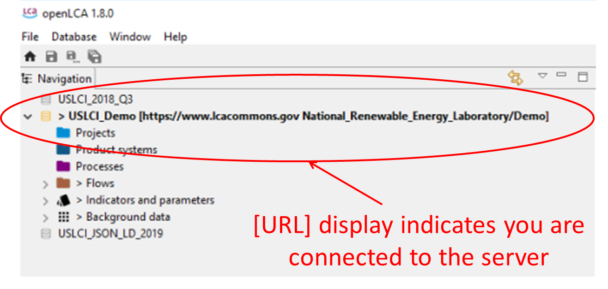

*Federal LCA Commons (FLCAC)*

*Data Submission Guidelines Handbook*

> Last Updated: *April 04, 2020*

FLCAC Collaboration Server

[https://www.lcacommons.gov/lca-collaboration](https://www.lcacommons.gov/lca-collaboration/search)

# **PREFACE**

> Thank you for your interest in providing access to your life cycle
> inventory (LCI) and/or life cycle assessment (LCA) data through the
> Federal Life Cycle Assessment Commons (FLCAC). Datasets submitted to
> the FLCAC Database must adhere to specific data documentation,
> formatting, and nomenclature requirements to ensure lossless loading
> of data and accurate representation in the server repositories.
> 
> The FLCAC Collaboration Server application provides federal and public
> users access to your data in major LCA data formats and permits
> coordination and connectivity between your data and other LCA data
> developers and resources.
> 
> The guidance and requirements in this document are intended to do the
> following:
> 
> 1\. **Help the** **Data Providers & Publishers:**

1.  > Provide sufficient metadata to describe unit processes and/or
    > product systems accurately

2.  > Prepare elementary and intermediate (i.e., technosphere) flows for
    > use in openLCA and compatibility with the FLCAC Collaboration
    > Server

3.  > Ensure consistency among and facilitate in proper interpretation
    > of datasets in the FLCAC repository as a whole

4.  > Provide proper attribution for government investment

> **2. Help Users & Researchers:**

1.  > Determine flow provenance and fitness for purpose

2.  > Ensure connectivity of their data flows to and from the other
    > flows in their own repositories, flows in other FLCAC
    > repositories, and to other providing/receiving LCA elements (e.g.,
    > other database unit processes and flows or life cycle impact
    > methods).

> The FLCAC data curation process is collaborative and iterative. As
> there is no central FLCAC curator to conduct an internal review of
> your dataset, each provider agency shall verify compliance with these
> Submission Guidelines and elementary flow connectivity with one or
> more impact methods. Each providing agency shall individually
> reconcile any issues identified in their internal dataset
> documentation review (i.e., metadata review). It is important to note
> that these guidelines do not cover conventions for technical review of
> the inventory data. **Also, note these guidelines are a living
> document and are updated as the FLCAC data submission process
> evolves.**
> 
> Before publishing data to the FLCAC, please review these guidelines,
> the Data Provider’s Content License Agreement
> (“Agreement”), and the Placing Your Data in the \[Public?\]
> Domain section of this document. If you have any questions, concerns,
> or recommendations, please contact: \[entity@agency.gov\]**.**
> 
> June 2019

**Acronyms and Abbreviations**

ANL Argonne National Laboratory

APA American Psychological Association

CPM Centre for Environmental Assessment of Product and Material Systems

DoD Department of Defense

DOE Department of Energy

EERE Energy Efficiency and Renewable Energy

EF Elementary Flow

EPA Environmental Protection Agency

EPD Environmental Product Declaration

FAA Federal Aviation Administration

FEDEFL Federal Elementary Flow List

FHWA Federal Highway Administration

FLCAC Federal Life Cycle Assessment Commons

GREET Gases, Regulated Emissions, and Energy use in Transportation

ILCD International Reference Life Cycle Data

IUPAC International Union of Pure and Applied Chemistry

JSON-LD JavaScript Object Notation for Linked Data

KML Keyhole Markup Language

LCA Life cycle assessment

LCAC Life Cycle Assessment Commons

LCC Life Cycle Costing

LCI Life cycle inventory

LCIA Life Cycle Impact Analysis

NAICS North American Industry Classification System

NAL National Agricultural Library

NETL National Energy Technology Library

NIST National Institute of Standards and Technologies

NREL National Renewable Energy Laboratory

OAIS Open Archival Information System

PM Particulate matter

PP Polypropylene

SETAC Society of Environmental Toxicology and Chemistry

SQL Structured Query Language

USACE US Army Corps of Engineers

USDA US Department of Agriculture

USFS US Forest Service

USLCI US Life Cycle Inventory

UUID Universally unique identifier

**GLOSSARY**

**Agency repository:** an agency repository is set of JSON files, which
hold specific data products or data sets, as defined by the agency.

**Data product:** a refined or integrated data set intended for
publication and re-use (e.g. product system model, unit process, Flow
List, impact method, data quality system, etc.)

**Data set:** a generic term for a digital unit of information, which is
part of a model or data product (e.g. product system model, unit
process, flows, flow lists, impact methods, unit groups, flow
properties, locations, etc).

**Elementary flow:** as materials, energy, or space that are taken directly from the environment or released directly back into the environment

**Interoperability:** dataset consistency between agency repositories
and/or repository groups in terms of metadata and documentation; life
cycle inventory data exchange format; product flow correspondence and
background data connectivity; and elementary flow correspondence

**openLCA**: a modular open-source software for life analysis and
sustainability assessment

**Platform administrator**: manages access of agency members to minimize
burden on the platform

**Repository Group**: FLCAC member administrated collection of
repositories on the FLCAC server

**Technosphere flow:** an input or output to a unit process that is a
product of one or more processes

**Unit process**: smallest element considered in the life cycle
inventory analysis for which input and output data are quantified

FEDERAL DATA PRODUCTS are products of federally funded and internally
executed LCA research. They have been subject to internal, agency review
and clearance processes, which confer additional value through quality
assurance.

FEDERAL DATA PRODUCTS are published through agency-managed repositories
hosted on the LCA Collaboration Server by the NAL.

INDUSTRY DATA PRODUCTS are sponsored by industry and executed either
internally or by consultants/academia. They may not have been formally
reviewed for quality assurance.

INDUSTRY DATA PRODUCTS are largely published through the USLCI
Repository, which is managed by the National Renewable Energy Laboratory
(NREL) and hosted by the NAL.

# Introduction

This handbook is divided into four major sections.

  - Section 1: Publishing data in the FLCAC

  - Section 2: How do I publish my data in the FLCAC?

  - Section 3: Frequently Asked Questions

  - Section 4: Resources

Section 1 helps provides a summary of the benefits of publishing in the
Federal LCA Commons (FLCAC), an overview of the existing FLCAC
repositories and repository groups, and the main dataset standards and
formatting requirements. Section 2 contains detailed guidance for
publishing data in the FLCAC Database in terms of onboarding,
formatting, review, publication, and preservation of data. This section
includes information on the agreed upon data conventions (e.g.,
nomenclature, formats, metadata, documentation) as well as curation and
publishing instructions. Section 3 provides answers to frequently asked
questions. Section 4 contains links to templates, tools, and other files
that support the data submission process. This section also includes
licensing agreements and the Creative Commons Legal Code.

# Section 1: Publishing data in the FLCAC

This section provides an overview of existing FLCAC repositories and
repository groups and their contents, a brief guide on how to choose
whether to publish in an existing or create a new group, and general
requirements for publishing data in the FLCAC Database. This section is
intended to help interested federal agencies understand the benefits of
publishing their data in the FLCAC Database and set reasonable
expectations for the publication documentation and standards.

## **Benefits**

LCA serves as a benchmarking and comparison tool for sustainable product
and process development. As public and private actors increasingly
utilize LCI data for decision-making and communications along the value
chain, LCI data availability, reliability, and geographic specificity
become increasingly important. The FLCAC Database offers federal data
developers with the opportunity to share complete, representative, and
well-documented LCI data with to a collection of repositories (i.e.,
“groups”) that are also available to the public. The FLCAC resource
allows users with influence across the value chain access to transparent
and representative LCI data alongside guidance for its intended use. The
goals of the FLCAC Database are to maintain data quality and
transparency, support the use of LCA, maintain compatibility with other
LCI databases, provide exceptional data accessibility, be fully and
sustainably supported, and support US industry competitiveness.

To date, the US FLCAC is the result of coordinated work by the US
Department of Agriculture (USDA), the Environmental Protection Agency
(EPA), the National Energy Technology Library (NETL), the National
Renewable Energy Laboratory (NREL), the Argonne National Laboratory
(ANL), the US Army Corps of Engineers (USACE), the Federal Highway
Administration (FHWA), the US Forest Service (USFS), the Federal
Aviation Administration (FAA), the Department of Defense (DoD), and the
National Institute of Standards and Technologies (NIST). This
coordinated work is hereafter referred to as "the Federal LCA Commons or
FLCAC." The FLCAC provides improved and coordinated access to Federal
LCA data. With this collaboration, the agencies have developed a more
streamlined process for FLCAC data documentation, curation, and
publication aimed at:

  - Expanding the FLCAC & Contribute Partner
    Base by:
    
    1.  Establishing the value of the FLCAC
    
    2.  Developing new data providers
    
    3.  Developing a consultive group of users

  - Technology Coordination, Integration,
    Interoperability, & Capacity Sharing by:
    
    4.  Developing tools for interacting with data
    
    5.  Developing tools to connect the FLCAC with users
    
    6.  Linking open data services

  - Data Coverage, Format, Quality, &
    Interoperability by:
    
    7.  Establishing and maintaining FLCAC data standards
    
    8.  Developing and maintaining a FLCAC governance structure
    
    9.  Adding capability to openLCA

The goal of the FLCAC is to leverage individual federal agency mission
activities to advance LCA data, research and information systems;
improve modelling methods consistency; and enhance public access to
Federal LCI data. In the near-term, FLCAC will coordinate data
documentation, nomenclature, and exchange conventions. In the long-term,
FLCAC will coordinate modelling conventions toward background data sets
for the US (e.g., for US electricity). FLCAC is positioned to collect,
compile, and provide public access to data and information that adds
value to life cycle assessors in an effective manner via a single-access
point. The harmonization of documentation standards and digital data
preservation and access will increase reviewability and reduce not only
data acquisition costs but also computer- and human-based
misinterpretation errors, and thus, data misuse.

## **Groups & Repositories**

If your main publication goals are aligned with an existing repository
and/or repository group, you may consider submitting your data to an
existing repository. For example, if your agency has an existing
repository group, you may want to publish the datasets to a repository
in this group or within a new repository under this group. If your
agency does not have an existing repository and/or repository group, you
may create one for the desired datasets.

#### Conventions for Repository Names

#### Repositories on the LCA Commons have a Group / Repository organizational structure. Repositories are subsets belonging to a Group and inherit all of the Group’s properties and settings. See ‘Adding a Repository’ in the Publication Workflow

#### Conventions for Repository Metadata

Here we need to develop and communicate clear distinctions between
“Federal LCA data” and “Data publicly available through government
funded resources”

## 

## **Expectations**

The FLCAC provides individual gate-to-gate, cradle-to-gate and
cradle-to-grave accounting of the energy and material flows into and out
of the environment that are associated with producing a material,
component, or assembly in the US. These data are intended to cover
commonly used materials, products, and processes in the US with
up-to-date, critically reviewed LCI data.

\[AUGMENT WITH COLLECTION POLICY TIGER TEAM WORK\]

## **Placing Your Data in the Public Domain**

To support increased access to and sharing of scholarly resources, as
well as to promote novel and innovative uses of LCA data, FLCAC requires
that all submitted datasets be placed in the public domain under the
terms of the Creative Commons Legal Code (CC0 1.0 Universal (CC0 1.0)).
By placing your datasets in the public domain, according to the CC0 1.0
license, you are removing “all of \[your\] rights to the work worldwide
under copyright law, including all related and neighboring rights, to
the extent allowed by law.” Please review the legal code of the CC0 1.0
Universal license before submitting your datasets, as well as the Data
Use Disclaimer Agreement (“Agreement”).

Data providers provide access and use restrictions appropriate to the
use of their data when publishing in the FLCAC. If your agency has their
own data access use restrictions policy, it should be included in
appropriate section of the published datasets. If your agency does not
have a specific policy, the FLCAC default may be used (see: Data
Provider’s Content License Agreement (“Agreement”)).

### **Dataset Citations**

Each dataset should include a recommended citation to which data users
may refer. All data published in the FLCAC should be cited using the
following format to acknowledge and credit the work of data creators and
the FLCAC as the source. For example, "Data Generator (2019). FLCAC,
Repository, Repository Group Name. Accessed April 15,
2019: https://www.lcacommons.gov/lca-collaboration/search/group/repository.

DOI’s are to be provided \[through USDA NAL or by each individual
agency\].

### **Data Formatting**

The International Organization for Standardization (ISO) specifies data
documentation formats for LCA in ISO/TS 14048:2002.

**Figure 1. Elements of ISO 14048 LCI & openLCA Process Documentation**

To facilitate compliance with this standard and provide a central access
portal, the FLCAC is structured upon the openLCA,\[1\] open source LCA
software schema. This schema includes the elements designated in General
Data Requirements. To minimize data formatting efforts and ensure all
metadata elements persist throughout submission, unit process and
product system datasets submitted to the LCA Commons should be edited in
the openLCA desktop modelling application. The openLCA software can be
downloaded free of charge at
[openLCA.org.](https://sourceforge.net/projects/openlca/) At the
beginning of the data submission process, you must check with FLCAC
Platform Administrator to ensure that your openLCA versioning is
compatible with the FLCAC Collaboration Server. Dataset editing guidance
is provided in the Formatting and Guidance on Data Compilation in
openLCA sections of this handbook. Once you compile, format, review, and
curate your unit processes and/or product systems in openLCA, you may
share them to the pre-selected repository via the FLCAC Collaboration
Server sync tool.

Please note that EcoSpold (v1 and v2) and International Reference Life
Cycle Data (ILCD) submissions generated by SimaPro, GaBi, ecoEditor, the
ILCD editor, or any other editor may not support the required metadata
fields. If you have data sets in these formats, you must first import
and edit these datasets in openLCA. The compiled and formatted data sets
may then be synced using the aforementioned Collaboration Server tool.
Inspecting your data in openLCA prior to submission is an opportunity to
preview how your data will appear in the LCA Commons. Alternatively, if
your work is in spreadsheets, you can use the openLCA spreadsheet format
to import your data into the openLCA desktop application and then edit
in openLCA.

Through the openLCA desktop application, modelers can also access the
work of others either through shared repositories or through the FLCAC
search application. Because the FLCAC Collaboration Server is built upon
the openLCA data model, agency repositories are comprised of openLCA
JSON formatted files, which will be indexed by the search application.
Data sets will be maintained locally as openLCA JSON files and in the
agency repository(ies) by the FLCAC Platform Administrator as openLCA
JSON files. The FLCAC Platform Administrator will make data products
available for download in JSON-LD and ILCD formats. The FLCAC Platform
Administrator will provide access to agency repositories and maintain
the single public facing search application, which will index each
public repository/repository group and help users browse and search data
sets. The FLCAC Platform Administrator will support agency data product
providers by publishing repositories and repository groups as directed.

Detailed guidance on the data submission process is covered in Section
2: How do I publish my data in the FLCAC?

## **General Data Requirements**

The FLCAC can accommodate data types included by the openLCA data model:

  - Product System Models

  - Unit Process Models

  - Life Cycle Impact Methods

  - Elementary Flows

  - Data quality methods

  - Flow Properties

  - Unit groups

  - Currencies

  - Actors

  - Sources

  - Locations

The FLCAC has a central Platform Administrator that will assign server
user credentials and manage the server platform. The onus of curating
and publishing data will fall to individual FLCAC member agencies. As
the FLCAC mega-repository grows, key considerations in LCI database
management are using proactive techniques that prevent technical debt
and to promote consistency, quality, and efficiency of the LCI data
therein. Guidance for adhering to these criteria are offered in this
document to the extent possible for the general use case. Individual
agencies will have specific use cases requiring additional database
management and should designate a FLCAC database administrator
accordingly.

Publishing in the FLCAC does not include integrating data sets into
internally consistent linked data products. The FLCAC Platform
Administrator does not currently have the capacity to integrate agency
data sets prior to publication. Any data set integration must occur
locally, at the agency prior to committing data sets to the FLCAC
Collaboration Servers or by the end-user. Therefore, if an agency
commits two separate Product System Models (PSMs) to two separate
repositories and the models use the same electricity model upstream, two
copies of the electricity model will reside in the FLCAC, rather than a
single electricity data set referenced by multiple processes. The FLCAC
is a collection of repositories, rather than an integrated data product.
This approach will help FLCAC users find and access data sets, but the
onus of integration will fall to the user.

### Data Reliability and Reproducibility

Flow data within the unit process(es) must be based on measurements
using a specified and standardized measurement method OR estimated using
methods and data described in specified archival or other publicly
available sources. Furthermore, data should represent a novel
contribution (i.e., unique process, unique market, update, and dataset
does not duplicate existing data) to the LCA community and be
non-proprietary. If the data are an update to a previously published
dataset, a note will be added to the metadata of the unit process
dataset (i.e., see: Table 4. Administrative Information Field
Conventions ‘Intended Application’ field of the ‘Administrative
Information’ tab). Unit processes that represent proxy upstream
processes from external databases should not be submitted (e.g.,
ecoinvent® process datasets).

### Data Aggregation, Completeness, & Allocation

Many of the data sets committed to the FLCAC will be the aggregated
results of dynamic process models. It is preferred that these data sets
are structured as PSMs, which provides context and relationships among
unit processes. However, these PSMs may be published as aggregated unit
processes, if necessary. It is understood that a certain level of
aggregation may be required to protect confidential data. In these
cases, it is requested to aggregate only as much as needed to protect
the data. Any aggregated or product system datasets must include
documentation stating the type of and motivation for the aggregation
(e.g., horizontal averaging, vertical aggregation; proprietary,
ease-of-use).\[2\] Unit processes may be submitted as single
gate-to-gate processes, or related processes grouped as product or
intermediate product systems. If multiple unit processes for a product
system are submitted, the linking between them should be explicit.

Similarly, agencies may commit “empty” PSMs, which provide the
relationships and context of individual unit processes and perhaps
references to background data sets, but do not include values. The use
case for empty PSMs is to distribute industry standard models, which can
be used to develop environmental product declarations (EPDs).

Though both unit process and system-level datasets may be submitted, the
FLCAC is striving for all Federal background data to be provided at a
unit process level. Please keep this in mind as you submit datasets for
publication.

Multi-functional unit processes should include all co-products and may
also include allocation factors or displaced products (according to the
discretion of the submitter). The allocation approach should be
justified and clearly described.

Agencies may also publish partial data sets (e.g. life cycle greenhouse
gas or water assessments) or partially terminated data sets (foreground
data sets), provided they are named, categorized, and documented
according to the FLCAC conventions.

A technosphere exchange that does not have a providing process included
in the same repository should be documented.

Processes from other databases should not be submitted as datasets.

### Nomenclature

Detailed guidance on process and flow nomenclature is
provided in M-1. General Information Field Conventions. Elementary Flow nomenclature specific guidance can be found in Appendix D: FEDEFL Nomenclature Rules, while guidance on Technosphere Flow and Process nomenclature can be found in Appendix E: ILCD Nomenclature Rules.

#### Categorization

Datasets from different databases with disparate categorization schemes
can prevent connectivity, cause duplications and/or confusion among
users, and result in a bulky database. Flows are categorized as either elementary or technosphere flows.

Therefore, FLCAC has adopted the
EPA Flow List for elementary flow classification. Elementary flows are further classified into eight classes as described in Appendix D: Highlight 4 The classification of elementary flows allows for a more systematic approach to the creation of the FEDEFL.
 
Technosphere flows and intermediate processes are further classified using the North American
Industry Classification System (NAICS) 2 digit/4 digit classification
scheme for categorizing intermediate processes and technosphere flows
(see:
[https://www.census.gov/eos/www/naics/](https://www.census.gov/eos/www/naics/)).
Please ensure that your datasets are submitted using this format and
reflect the latest NAICS updates, which occur roughly every three to
four years.

Additional guidance for using the EPA Elementary Flow list can be found on the FEDEFL [github repository wiki page](https://github.com/USEPA/Federal-LCA-Commons-Elementary-Flow-List/wiki) or the [FEDEFL guidance document](https://cfpub.epa.gov/si/si_public_record_report.cfm?Lab=NRMRL&dirEntryId=341199). Additional guidance on the ILCD nomenclature for technosphere and process nomenclature can be located in the [ILCD Handbook](http://eplca.jrc.ec.europa.eu/uploads/MANPROJ-PR-ILCD-Handbook-Nomenclature-and-other-conventions-first-edition-ISBN-fin-v1.0-E.pdf)
### Data Quality Scheme

Within openLCA, the only data quality scheme available by default is
that of ecoinvent®. Publishing agencies may have developed their own
scheme and still, some may not use a scheme at all. The FLCAC does not
require a specific scheme be utilized; however, there is guidance in
this document on how to utilize the EPA Data Quality Pedigree Matrix if
it is elected. The USLCI uses the EPA Data Quality Pedigree Matrix
(downloaded and imported into openLCA from the GreenDelta downloads
page).

### Global Parameters

Per the developers of openLCA, project- and even “global”-level
parameters defined in the openLCA desktop application (i.e.,
agency-user-defined strings with character restrictions) are not
compatible between FLCAC repositories. This means that the FLCAC has no
defined list of global-level parameters and no parameterization will
occur between server repositories and/or repository groups. However,
parameters defined as “global” in the openLCA desktop application are
reflected when committed to a single repository on the FLCAC server. To
ensure data compatibility across FLCAC repositories and repository
groups, FLCAC has elected to limit the number of ‘global parameters’
allowable for use in the FLCAC repository. Please check the FLCAC
Platform Administrator if your datasets require the use of a
repository-level, global parameter.

### Change Logs

As datasets in a repository are created, modified, and/or removed, a
record or change log of these occurrences shall be made. Each agency
shall maintain change logs individually such that a centralized FLCAC
change log may be made available by the FLCAC Platform Administrator at
\[an interval to be defined\]. Individual agency repository
administrators should track changes made to the repository alongside the
commit history.Any updates to these guidelines shall be noted along with
the centralized FLCAC change log.

# Section 2: How do I publish my data in the FLCAC?

The purpose of this section is to help you, the Data Provider,
understand the process for publishing LCI data in the [FLCAC
Database](https://uslci.lcacommons.gov/uslci/search).

This section is divided into the following subsections.

1.  Coordinating work in the FLCAC Collaboration Server

2.  Overview of the \`Digital Curation Process’

3.  The openLCA field conventions and metadata guidance

## **Coordinating Working in the FLCAC Collaboration Server**

The onus of curating and publishing data will fall to individual FLCAC
member agencies. As the FLCAC mega-repository grows, key considerations
in LCI database management are using proactive techniques that prevent
technical debt and to promote consistency, quality, and efficiency of
the LCI data therein. Guidance for adhering to these criteria are
offered in this document to the extent possible for the general use
case. Individual agencies will have specific use cases requiring
additional database management and should designate a FLCAC database
administrator accordingly.

Establishing a repository on the FLCAC Collaboration Server requires an
ongoing institutional partnership with the FLCAC, in which your agency
actively curates, manages, and updates its repository(ies) according to
FLCAC’s data conventions, while the FLCAC Platform Administrator provide
system administration, and persistent access to the repository.

The FLCAC Platform Administrator (NAL) will host one or multiple
repository group(s) for each partner agency as necessary. Partner
agencies will maintain and archive data sets within the group
repository(ies) locally and maintain and version data hosted at the NAL.
Partner agencies must maintain data products in the version of openLCA
desktop application, which is current with the version deployed for the
FLCAC Collaboration Server.

The purpose of this section is to guide you through the publication
process. These guidelines are compiled to assist in the curation of data
sets to ensure that agency data products are compliant with agreed upon
conventions related to naming, categorization, nomenclature, and
structure within the openLCA data model. These instructions can help you
in, completing dataset metadata fields and using the openLCA
Collaboration Server platform. The objective of these guidelines is to
assure data set consistency for indexing, display, and search.

Your role in the publication process is to transform your raw LCI data
into a product that is ready for publication in the FLCAC Database and
to submit the data to the Collaboration Server using the openLCA desktop
application. ‘Transform’ means to put your data into the FLCAC
Database's [data
format](https://github.com/uslci-admin/private-uslci-content/blob/dev/docs/submission_handbook/02-how-to-publish-in-the-uslci.md#data-publication-platform) and
pair your data with robust metadata so that your data users understand
how to properly interpret and apply your data.The documentation,
metadata guidance, and resources in this Data Submission Guide will be
essential resources in that process.

The International Organization for Standardization (ISO) specifies a
framework for archival concepts necessary for long-term digital
information preservation and access in ISO 14721:2012. This framework
designates the importance of provenance information such as the history
of content information, custody, and change history.

**Figure 2. Open Archival Information System (OAIS) Preservation
Description Information**

To facilitate compliance with these standards, FLCAC users are
encouraged to use the openLCA Collaboration Server including the
editorial features as their principal project management and
communication tool. In this way, member teams may communicate and
coordinate member data curation and maintenance of their FLCAC
repository(ies) on the server. The editorial features assist in the
storage, handling, and migration of LCI data during the curation and
publication process. This platform contains robust features for version
control, issues management, and team communication. Moreover, it makes
it easy for the Data Provider to keep a local version of the data
curation process and end product once the project is complete. Early in
the publication process, the FLCAC Platform Administrator will work with
you to get you set up with a username and one or more private data
repositories on the platform.

**Figure 3. Team coordination schematic for database management on FLCAC
Collaboration Server**

Using this application, LCA data may be edited within a local openLCA
database and then directly committed to the collaboration server. The
new server-software synergy will allow authorized users to collaborate
on data provision and editing from any workstation. Public users can
access the data and make comments on the repository content

As mentioned in the Formatting section, FLCAC uses openLCA as its
platform for receiving, reviewing, and publishing LCI data. The
[openLCA](http://www.openlca.org/) software is a free, open source LCA
desktop application in which end-users can import data from many public
and commercial LCA software applications including GaBi and SimaPro. The
openLCA desktop application is also the platform from which your data
may be synced to the FLCAC Collaboration Server online

The homepage for the FLCAC is
[www.lcacommons.gov](http://www.lcacommons.gov).
Agency members will have capability to access FLCAC data sets via this
platform according to assigned user roles. Repositories, by default, are
set as private but the Owner of a repository can set the status to
public (see: Publication and designate users to have access with
specific roles or they may be set as public, in which case, all agency
members have access. Public end-users will also be able to access all
published FLCAC data sets, which reside on the FLCAC Collaboration
Server, through the content management application (i.e., all group
repositories set to ‘public’ status).

## **Overview of the Digital Curation Process**

FLCAC uses a Digital Curation Process for receiving, reviewing,
publishing, and preserving data and metadata submitted to the FLCAC
Database. The process is divided into five phases:

1.  Onboarding

2.  Formatting

3.  Review & Curation

4.  Publication

5.  Preservation

Each of the five phases is discussed in detail below but a quick
overview of the entire procedure for submitting data to the FLCAC is as
follows:

Once the agency has developed data for the FLCAC:

  - **Install Software**: If not already in use, download the openLCA
    software for free from
    [http://www.openlca.org/download/](http://www.openlca.org/download/)
    and install it on your desktop

  - **Establish Data Quality System**: If using a data quality system,
    install or establish a consistent system for your team; e.g., use
    default ecoinvent® system, agency-specific system, or download the
    [US EPA’s data quality system](http://www.openlca.org/download/) and
    import it into openLCA

  - **Format Data**: use these Submission Guidelines to format the
    preliminary LCI data in openLCA, including data quality if elected
    
  - **Map Elementary Flows to FEDEFL**: Use the instructions found on the [FEDEFL wiki](https://github.com/USEPA/Federal-LCA-Commons-Elementary-Flow-List/wiki) to map the
    openLCA database to existing FEDEFL flows   

  - **Obtain FLCAC Server Account**: If not yet an existing account
    user, the FLCAC Platform Administrator will set up the FLCAC
    Collaboration Server account for the submitting agency

  - **Commit to Private Repository**: Commit your datasets from an
    openLCA database to a private repository on your selected group on
    the Collaboration Server

  - **Curate Datasets on Server**: agency team may use the Collaboration
    Server editorial features to communicate edits and finalize the
    curation of the private version of the datasets on the FLCAC
    platform

  - **Publish Datasets on Server**: Once the agency (agency team) has
    approved the indexing of the datasets in the private version, the
    final version is approved and migrated to the agency’s public
    repository group

  - **Maintain Datasets on Server**: The agency maintains the local
    openLCA desktop version of the datasets for preservation
    individually and coordinates as a team to commit their edits to the
    server private working repository; here, best practices for all in
    the agency team are to:
    
      - **Fetch Changes from Server**: Connect to the Collaboration
        Server to fetch the latest changes to the private server working
        repository to your desktop application
    
      - **Make Updates Locally**: Edit to make changes, augment, update
        or add datasets in the local desktop version
    
      - **Commit Updates** **to Server**: Commit changes to the private
        agency working repository for internal agency review (using the
        editorial features)
    
      - **Publish Updates**: when approved, team changes can be migrated
        to the public agency repository group for publication by the
        agency repository administrator

**Figure 4. General workflow schematic between agency team members on
the FLCAC server**

The harmonization of documentation standards as well as digital data
preservation and access will increase the collaboration potential and
reviewability of the LCA data exchange process. Increasing harmonized
collaboration among agencies and stakeholders in compiling and
maintaining LCA data will significantly reduce not only data acquisition
costs but also computer- and human-based misinterpretation errors, and
thus, data misuse.

The FLCAC uses JSON-LD and ILCD file formats,\[3\] formats that retain
durability (i.e., stored metadata travel well with the moved files).
Because the FLCAC Collaboration Server is built upon the openLCA data
model, which supports this file type, FLCAC repositories are comprised
of openLCA JSON and ILCD formatted files, which will be indexed by the
search application. Data sets will be maintained locally as openLCA JSON
or ILCD files and in the agency repository(ies) by the FLCAC Platform
Administrator as openLCA JSON and ILCD files. The FLCAC Platform
Administrator will make data products available for download in JSON-LD
and ILCD formats. The FLCAC Platform Administrator will provide access
to agency repositories and maintain the single public facing search
application, which will index each public repository/repository group
and help users browse and search data sets. The FLCAC Platform
Administrator will support agency data product providers by publishing
repositories and repository groups as directed.

## **Onboarding**

The objective of the Onboarding phase is to obtain the tools needed to
use the FLCAC Collaboration Server.

The Onboarding phase is composed of the following elements:

1.  **Download Software**: Download and install the openLCA desktop
    application (if not an existing user)

2.  **Data Quality**: (where appropriate) convert data quality to EPA
    Data Quality Pedigree Matrix system compatible with the openLCA
    software

3.  **Credentials**: Acquire a FLCAC Collaboration Server username and
    password. The FLCAC Platform Administrator will assign your team
    with the required credentials

4.  **Guidelines**: Download this & GreenDelta’s LCA Collaboration
    Server Manual to have on hand

5.  **Server:** Bookmark the FLCAC portal landing page

To facilitate compliance with this standard and provide a central access
portal, the FLCAC is structured upon the openLCA,\[4\] open source LCA
software schema. The openLCA software can be downloaded free of charge
at from
<http://www.openlca.org/download/>. At
the beginning of the data submission process, you must check with FLCAC
Platform Administrator to ensure that your openLCA versioning is
compatible with the FLCAC Collaboration Server.

If your team will be using a data quality system, ensure that system is
compatible with the openLCA software and distributed among the team.
Within openLCA, the only data quality scheme available by default is
that of ecoinvent®. The USLCI uses the EPA Data Quality Pedigree Matrix
(downloaded and imported into openLCA from GreenDelta’s web page). The
FLCAC does not require a specific scheme be utilized; however, Appendix
G: Using the EPA Data Quality Pedigree Matrix in openLCA provides
instructions for utilizing the EPA Data Quality Pedigree Matrix.

## **Formatting**

The Formatting phase is concerned with entering your datasets into the
openLCA software. To minimize data formatting efforts and ensure all
metadata elements persist throughout submission, unit process and
product system datasets submitted to the LCA Commons should be edited
using this modelling application.

Name all original data sets that you submit to FLCAC according to the
ILCD naming convention (see Guidance on Data Compilation in openLCA).
The name should reflect the process or activity as follows: base name;
treatment, routes, standards; production type, location type;
quantitative flow properties. If you have modified or customized a unit
process from a commercial database, FLCAC requests that you submit the
process named exactly as it is in the original process with an
indication (i.e., in the comment field) that it is a modified version of
the original. For example, the comment for the modified ecoinvent®
process “carbon dioxide liquid, at plant/RER U” might read: ‘adapted to
reflect US average electricity grid.’

Detailed guidance on process and technosphere flow nomenclature is provided in Table
M-1. General Information Field Conventions and Appendix E: ILCD
Nomenclature Rules. A technosphere flow that is not being submitted as a
dataset and is not already in the FLCAC should be categorized in the
Technosphere Flows\\‘CUTOFF’ folder or a reasonable proxy from the FLCAC
identified with a note in the ‘Input Flow, Description’ field regarding
the flow origin (database and flow name). Processes from other databases
should not be submitted as datasets.

### Elementary Flow Names

Elementary flows are data components of LCA data that describe common
physical items that move from the technosphere into nature or vice
versa. They are used in exchanges in life cycle inventory (LCI) data to
represent these movements into and out of processes, and they are used
in Life Cycle Impact Assessment (LCIA) methods to match inventory data
with impact characterization factors. Hence, they serve a critical role
in LCA modeling and are essential in achieving LCA data
interoperability.

The US EPA has developed a master elementary Flow List ([the FEDEFL](https://github.com/USEPA/Federal-LCA-Commons-Elementary-Flow-List)), which is
available in CSV and openLCA schema JSON-LD formats, and provides resources to help with mappings. The current release version is available via the
FLCAC portal. The ([the FEDEFL wiki](https://github.com/USEPA/Federal-LCA-Commons-Elementary-Flow-List/wiki))
provides guidance on converting an established Flow List in a standard openLCA format to FEDEFL
flows. Please see the US EPA report, [The Federal LCA Commons Elementary Flow List: Background, Approach, Description and Recommendations for Use](https://cfpub.epa.gov/si/si_public_record_report.cfm?dirEntryId=347251&Lab=NRMRL&simpleSearch=0&showCriteria=2&searchAll=elementary+flows&TIMSType=Published+Report&dateBeginPublishedPresented=07%2F31%2F2019) for more information regarding the Flow List requirements and nomenclature.

Elementary flow names must correspond directly to the impact method used
in the LCIA. This protocol assures users that your dataset can connect
your elementary flows to the associated LCIA method. Document LCIA
methods used in the ‘Intended Application’ field of the Administrative
Information tab in openLCA. If data being submitted have NOT been used
in an LCIA, please use flows from the openLCA reference list. If you
used SimaPro or GaBi modeling software and an impact method that is also
provided for in the openLCA suite of LCIA methods, please run your
inventory and impact results in openLCA and compare them to those
obtained in SimaPro or GaBi to confirm that openLCA is reading flows
correctly.

### Intermediate Flow Names

Intermediate flows are are either products or processes from the
technosphere (i.e., not elementary flows).

1.  > ***Intermediate product flows*** are technosphere flows that are a
    > product of one or more processes and have flowable names and flow
    > properties. Technosphere or product flows are the result of a
    > process (or processes) and flow as exchanges between processes
    > (unlike elementary flows that flow as exchanges to and from
    > environmental compartments). All intermediate product flow names
    > should be decoupled from their associated activity flow names
    > (i.e., process name) for transparency and clarity. That is, a
    > product name should not contain metadata that is specific to the
    > activity context such as the location or year. The intermediate
    > product name should be generic to any activity context so as to
    > avoid unnecessary duplication of product flow names. Likewise,
    > product flow properties such as units, formulas, synonyms,
    > infrastructural flow designation, etc. may be defined in the
    > metadata and should also not be included in the flowable name.

2.  > An ***intermediate process*** is an activity containing at least
    > one intermediate product flow. Activities are exchanges containing
    > at least one input flow and one output flow (i.e., defining a
    > relationship between flows). The intermediate process flow name
    > should reflect the product or service it represents; the product
    > reference output is given the same name as the process name; the
    > naming conventions are as follows: Base name; treatment, routes,
    > standards; production type, location type; quantitative flow
    > properties. The base name is a general descriptive name of the
    > process using technical language. The technical name should be
    > given as it is used in the respective industry or toward their
    > customers. The standards include qualitative information about the
    > process in technical terms (see Rules 1-19 Appendix E: ILCD
    > Nomenclature Rules or the full [ILCD
    > Handbook](http://eplca.jrc.ec.europa.eu/uploads/MANPROJ-PR-ILCD-Handbook-Nomenclature-and-other-conventions-first-edition-ISBN-fin-v1.0-E.pdf)
    > for a list of potential descriptive terms). The quantitative
    > process properties further specify information on process in
    > technical quantitative term(s).

As mentioned, data curation services will not include integrating data
sets into internally consistent linked data products. Any data set
integration must occur locally, at the agency prior to committing data
sets to the FLCAC Collaboration Servers or by the end-user. To link
processes in your datasets, use the exact nomenclature of the
intermediate flow. If the process to be linked only exists in another
agency repository, a duplicate of the process may be submitted or the
exact nomenclature used and the repository noted in the ‘Input Flow,
Description’ field. Processes from other databases (i.e., already
existing outside the FLCAC) should not be submitted as datasets.
Therefore, a technosphere flow that is not being submitted as a dataset
and is not already in the FLCAC should be categorized in the
Technosphere Flows\\ ‘CUTOFF’ folder or a reasonable proxy from the
FLCAC identified with a note in the ‘Input Flow, Description’ field
regarding the flow origin (database and flow name).

### Metadata Guidance

As FLCAC interagency coordination increases, the new standard for data
formats and documentation is being advanced. In order to move toward
interoperability and transparency, FLCAC harmonization of digital data
access and preservation will increase our collaboration potential and
the reviewability of the LCA data exchange process. These efforts will
significantly reduce not only data acquisition costs but also computer-
and human-based misinterpretation errors, and thus, data misuse.

As such, and to be more aligned with international protocols for all
newly developed data, the current FLCAC repository standardization is to
strive for 100 percent metadata completion To facilitate each agency’s
accomplishment of this criteria, these guidelines include complete
Metadata Guidance Tables with conventions and examples for every field
in the openLCA JSON-LD format (except ‘Social aspects’). The tables are
arranged by the field sections as displayed in the tabs of the openLCA
window views.

**Figure 5. openLCA window view – field section tabs**

The Metadata Guidance Tables will help you complete the formatting stage
for your datasets so that you are prepared for the Review phase.

## **Review**

Once your datasets are formatted in the openLCA JSON-LD desktop
application and all metadata fields are completed, the datasets can be
synced to the FLCAC Collaboration Server for the Review phase. The first
time you sync your data to the FLCAC Collaboration Server, you will
first need to complete the Onboarding tasks and create a repository
(within a group) on the FLCAC server.

An overview of the Review phase is as follows:

  - **Obtain Server Account**: If not yet an existing user, the FLCAC
    Platform Administrator will set up the FLCAC Collaboration Server
    account for the submitting agency

  - **Commit to Private Server Repository**: Commit your datasets from
    an openLCA database to a private repository on the Collaboration
    Server

  - **Curate Data** on Server: agency team may use the Collaboration
    Server editorial features to communicate edits and finalize the
    private version of the datasets on the platform

  - > 

  - **Figure 6. Fetch and commit practices between team members on the
    FLCAC server**

  - 
#### Login

After you have completed the preliminary sign up tasks, you can
familiarize yourself with the server navigation and features. First, you
may login to the FLCAC Collaboration Server portal.

**Figure 6. FLCAC Portal Login**

#### Default Viewer

Once you login to the portal, the viewing window is different and a list
of repositories will be the central default display.

**Figure 7. Default view for FLCAC Collaboration Server Members**

#### Repositories & Groups List View

You can switch between viewing a list of repositories and that of
repository groups on the left-hand side of the portal.

**Figure 8. Toggle Repository Groups view for FLCAC Members**

#### Add a New Repository

Select a group to view the contained repositories and/or add a new
repository. Creating a new repository allows you to designate in which
Group the repository will be housed via a pull-down menu. Note that you
will only have access to the groups to which you have been assigned
roles.

**Figure 9. Create a new repository on FLCAC**

Repository names should follow the following conventions for syntax:

#### Conventions for Repository Names

#### Repositories on the LCA Commons have a Group / Repository organizational structure. Repositories are subsets belonging to a Group and inherit all of the Group’s properties and settings. 

##### Conventions for naming Groups

Groups will reflect the names or titles of the organization publishing
the repository on the LCA Commons. The group name will follow the
standard conventions for the capitalization of titles:

  - #### Upper case
    
      - #### First and last word
    
      - #### Nouns and important words

  - #### Lower case
    
      - #### Coordinating conjunctions (and, but, for)
    
      - #### Articles (a, an, the)
    
      - #### Prepositions (at, by, from, etc)

  - #### Acronyms will be upper case, without spaces or other delimiters

  - #### Words will be separated with underscores ( “\_” ) (No other punctuation may be used)

#### 

##### Conventions for naming Repositories

#### Repository names will reflect the context, goal, or scope represented by the published data set. Repositories names will follow the standard conventions for capitalizing sentences:

  - #### Upper case
    
      - #### First word
    
      - #### Proper nouns

  - #### Acronyms will be upper case, without spaces or other delimiters

  - #### Words will be separated with underscores ( “\_” ) (No other punctuation may be used)

#### 

##### Examples for Group / Repository names

1.  National\_Renewable\_Energy\_Lab / USLCI

2.  US\_Environmental\_Protection\_Agency / Heavy\_equipment\_operation

3.  NC\_State\_Dept\_Forest\_Biomaterials / Kraft\_pulp

####   

#### Syncing Data from openLCA to the Server

Once you have created your repository on FLCAC, you can sync your data
to and use the features of the Collaboration Server.

1)  First, ensure that you have collaboration enabled in your openLCA
    desktop application preferences by checking the “Enable
    collaboration” box in ***“File \> Preferences.”***

**Figure 10. Enable collaboration in openLCA desktop**

2)  **Credentials:** Under “User,” you may need to enter your assigned
    Collaboration Server username ID and password credentials that were
    assigned during Onboarding by the FLCAC Platform Administrator.

> **Server URL: https://www.lcacommons.gov/lca-collaboration**
> 
> **User: Your Username**
> 
> **Password: Your Password**

3)  **Connect:** Next, navigate to your database in openLCA, right-click
    on the database and select ***“Repository \> Connect to
    Repository.”***

**Figure 11. Connect openLCA database to FLCAC repository**

4)  **Designate:** Then, you designate which repository to which to
    connect. You will name the repository exactly as it is in the URL at
    the Collaboration Server. Adjust the repository path to reflect the
    group and repository name using the syntax:
    “Group\_Name/Repository\_Name”.

**Figure 12. Adjusting the openLCA repository connect pathname**

**Figure 13. Group and repository name locations**

You will know that your desktop database is connected to the server by
the URL in the database name.

**Figure 14. Repository-connected database in openLCA**

5)  **Commit:** Now that your openLCA desktop application is connected
    to the server repository, you can commit the data to the server
    repository by right-clicking on the database and selecting
    ***“Repository \> Commit.”*** You should see the commit window
    appear.

**Figure 15. Commit changes to a repository**

**Commit, cont.:** You must select the entities you wish to commit and
enter a commit message. Best practices for commit messages include short
phrases indicating the datasets being committed. The commit message will
display next to each dataset committed in the Collaboration Server (see
next page) and if the message is extensive, it will affect the ease of
navigation through the data as it displays on the server.

If you are committed a large number of datasets for the first time, the
commit action can take some time (minutes up to an hour for very large
datasets). However, once the repository is established, updates may be
committed in seconds. For reference, the entire USLCI Database takes
about four minutes to commit to a new repository. You should see
messages indicating that the application is:

  - Searching for referenced changes

  - Checking against libraries

  - Committing changes

  - Estimated time: \# minutes

  - Indexing datasets

**Figure 16. Progress indicators for database change commits**

6)  **View Commits:** Once the repository is committed, you should be
    able to navigate to your repository on the Collaboration Server and
    verify the presence of your datasets, when the change was made, and
    the commit message.

**Figure 17. Viewing commits on the FLCAC portal**

#### Using the Editorial Features to Curate Data

Once the desktop repository has been synced to the Collaboration Server
and is viewable on the FLCAC portal, you can use the editorial features
to curate the initial commit and/or to curate ongoing updates to your
repository. Each FLCAC member agency should coordinate with their
respective team(s) to individually manage the data curation process for
their respective repositories.

**Figure 18. GreenDelta Collaboration Server Use Case: Editorial
Features**

First, repository roles should be assigned to team members. Only
repository Owners can assign roles. Owners can also create, move, and
delete repositories, adjust repository settings, and edit repository
members. An Editor may manage reviews and comments. A Reviewer can
review comments and comment on specific dataset fields. A Contributor
can commit to repositories and a Reader may only view and fetch
repositories. It is up to each agency repository administrator to
determine the best user rights configuration for his/her team. The
following table gives an overview of roles and user rights that may be
assigned in the FLCAC Collaboration Server.

**Table 1-1. Repository roles and associated user rights**

| Repository Rights               | Reader | Contributor | Reviewer | Editor | Owner |
| ------------------------------- | ------ | ----------- | -------- | ------ | ----- |
| View & fetch                    | ✔      | ✔           | ✔        | ✔      | ✔     |
| Commit data                     |        | ✔           | ✔        | ✔      | ✔     |
| Comment on specific fields      |        |             | ✔        | ✔      | ✔     |
| Review comments                 |        |             | ✔        | ✔      | ✔     |
| Manage comments                 |        |             |          | ✔      | ✔     |
| Manage review tasks             |        |             |          | ✔      | ✔     |
| Create repositories             |        |             |          |        | ✔     |
| Edit repository members & roles |        |             |          |        | ✔     |
| Adjust settings                 |        |             |          |        | ✔     |
| Move repositories               |        |             |          |        | ✔     |
| Delete repositories             |        |             |          |        | ✔     |

**Dashboard:** Once roles and user rights have been assigned, toggle the
editorial features (i.e., “review mode”) by using the pencil icon in the
upper-right of the home screen when you login to the FLCAC portal. The
chat icon allows messaging between repository team members and the paper
tray icon opens the task manager.

**Figure 19. FLCAC portal member dashboard features**

**Task Manager:** Using the platform’s task system requires that at
least one team user has Reviewer user rights. This system will help the
agency-assigned repository administrator orchestrate the Data Curation
tasks by allowing a repository owner and his/her team members to
identify, assign, track, and resolve issues that arise during the
curation process.

The editorial features also allow entire data sets and/or specific
fields of a data set to be commented on in the review mode (pencil icon
in upper-right of the user dashboard). Once activated, the review mode
displays speech bubbles for each commentable field. The comments can be
released immediately as a draft or for review by the moderator. These
comments will also be displayed in the ‘Comments’ tab in the local
openLCA user’s desktop application in the synced database. These tools
will make the curation process more efficient and ensure that all
relevant correspondence is in a single location.

The features allow review tasks to be created such that specific
datasets may be slated for review and tasks assigned to team members.

**Figure 20. Creating a new review task on the FLCAC portal**

The Collaboration Server editorial features task system allows tasks to
be assigned to specific team members (i.e., as reviewers). A task noted
“in progress” is awaiting release or moderation depending on whether
the user has Editor or Reviewer role status. A “completed” task has been
released and/or reviewed, and a “canceled” task simply indicates no
further action is required.

**Figure 21. FLCAC portal editorial features review task dashboard**

Within the datasets slated for curation, there are comment bubbles for
each field so that team members can leave notes for any element.
Comments can be made in datasets but are not viewable until released.

**Figure 22. Adding comments to datasets**

Releasing comments allows designated team members to view the comments,
either one-by-one in the individual comment bubbles of the dataset
fields or all-at-once in a list of comments (viewable by toggling
“Comments” on the left-hand side of the dashboard screen).

**Figure 23. Releasing comments for review**

**Figure 24. Tracking review progress in datasets**

On the left-hand side of the dashboard screen, team members can see all
comments in a list view by toggling “Comments.”

**Figure 25. Viewing compiled review comments**

Team members can see comments in their respective desktop applications
by fetching changes. Just as on the FLCAC server when signed in, users
may view comments in the desktop application in two ways: 1) within the
dataset, and 2) as a compiled list.

**Figure 26. Viewing comments in openLCA desktop dataset**

### 

**Figure 27. Viewing comments in openLCA desktop as compiled list**

Fetch & Commit Workflow

For team members to coordinate maintenance and curation of FLCAC
repositories, the openLCA desktop application allows changes to be made
to, viewed, and/or retrieved from the remote server. The desktop
application uses the term “Commit” to refer to the action of committing
local changes to the server; whereas, the term “Fetch” is for retrieving
server versions to the local desktop. Any changes and curation comments
may also be viewed remotely and/or synced to or from the local server.
Server comments may be reviewed without affecting a local database but
to reflect in a local database those commits made by other team members
to server repositories, users must “fetch” changes and use the “Diff
Tool.” The Diff Tool displays the differences between the local version
of a database and that of the associated server repository.

To fetch changes from a server repository, right-click on the desktop
database in openLCA and select ***“Repository \> Fetch.”*** If no
changes have been committed by other team members, you will see a
message “Up to date – No changes fetched.” If updates or changes have
been made by team members, you will see a list of changes to be fetched,
which provides a summary of changed and/or new elements. Once you select
“OK,” the “Diff Tool” window will display. This tool allows you to
review changes and either accept the server changes or retain the local
desktop status of each element. Simply, select “move from right to left”
to accept the changed element from the server and “mark as merged” to
reject the server change and retain the current element of the local
version. FLCAC recommends fetching changes with a frequency appropriate
for the activity frequency of the team to maintain transparency and
clarity of tracing changes and avoiding conflicts.

### Time Requirements

The Review phase can involve iterative communications via the Tasks
tracker on your FLCAC repository and often requires the most time in the
data curation process. It is left to individual agencies to complete
this phase for their dataset curation on an individual basis. Each
member must play an active role in this collaborative effort for this
phase of the process to be completed.

### Best Practices

To account for multi-user collaborations on the server, and for ongoing
repository maintenance, the best workflow practice is to guide your team
to:

1)  **Fetch:** Always connect to the server and fetch server updates to
    your local database before making changes in your local project.
    This practice ensures all team members are working from the most
    current version of the repository datasets. To perform the fetch,
    use the “Diff Tool” to sync all or partial changes from the server

2)  **Edit:** Make changes in the openLCA desktop application;
    occasionally refresh your connection to reflect changes from team
    members

3)  **Commit:** Commit your changes to the server before disconnecting

## **Publication**

Once your data have been reviewed and curated in the private FLCAC
working repository, the dataset(s) are ready for publication. By
default, FLCAC repositories are private. Repository Owners must toggle
them to public for publishing. FLCAC recommends for best practices that
the curated private repository be cloned and made public such that the
private database working copy is available in the background to receive
updates and maintenance. In this way, the public version is static until
scheduled/announced updates occur and the original private repository
can be modified on an as needed basis. Once the private working copy
update and curation tasks are complete, this copy can be repeatedly
cloned to replace the outdated published version.

**Figure 28. Cloning a repository on the FLCAC server**

**Figure 29. Publishing a repository on the FLCAC server**

Your newly published repository will appear under its group name on the
public FLCAC portal as a repository on the right hand side of the portal
landing page.

**Figure 30. Repository group names in public view**

For best practices, FLCAC recommends that once repositories are made
public, the agency team members ensure that their respective local
openLCA desktop application databases fetch changes to reflect the most
current versions. Further, as in the FLCAC server, FLCAC recommends one
working copy and one ‘clean’ copy of each repository be kept on the
desktop application. That is, changes should always be fetched from and
updates always be committed to the private server *working copy* until
it is ready for official publication. In this way, the public server
version remains static and the desktop clean copy reflects this public
version.

In summary, the best practices workflow is as follows:

  - **Commit** to Private Server Group: Commit your datasets from
    openLCA to a private group on the Collaboration Server

  - **Curate** Data on Server: agency team may use the Collaboration
    Server editorial features to communicate edits and finalize the
    private version of the datasets on the platform

  - **Publish** Data on Server: Once the agency (or agency team) has
    approved the indexing of the datasets in the private version, the
    final version is approved and cloned/migrated to the agency’s public
    repository group

  - **Maintain** Data on Server: The agency maintains the local openLCA
    desktop version of the datasets for preservation.

To account for multi-user collaborations on the server, and for ongoing
repository maintenance, the best workflow practice is to guide your team
to:

  - **Fetch Changes from Server**: Connect to the Collaboration Server
    to fetch the latest changes from the private server working
    repository to your desktop application

  - **Make Updates Locally:** Edit to make changes or add datasets in
    the local desktop version

  - **Commit Updates to Server:** Commit changes to the private server
    working repository for internal agency review (i.e., using the
    editorial features)

  - **Publish Updates:** Migrate changes to the public agency repository
    for publication

The FLCAC Database is updated with new and revised data on an as needed
basis for most member agencies. Some groups (e.g., NREL) update on a
quarterly basis. Thus, the publication timeline of your data depends on
your agency publication schedule, the dataset/repository size and when
your Onboarding & Formatting phases begin. The timeframe is heavily
dependent on the response times between you and team members working to
curate the repository data during the iterative communications of the
Review phase as well as how many processes are being submitted.

## **Preservation**

As the FLCAC is primarily an access system, it is left to individual
agency members to preserve the final dataset files according to ISO
14721 standards for long-term digital information preservation. That is,
the final dataset file versions are stabilized, checked for fixity
(i.e., verifying no digital file corruption), and stored such that the
original and published datasets and their supporting metadata are
archived. Only the initial dataset submission and the version final
dataset as published are archived. These datasets will be saved until
the next update is submitted and published. Data longevity should be
noted at the time of publication according to each member’s publishing
schedule. Older datasets may not be saved in the FLCAC Collaboration
Server but FLCAC members should retain the older datasets such that they
are available upon request or for comparison and verification. Updates
to previously published datasets shall contain a relevant note in the
‘Intended Application’ field of the unit process Administrative
Information. If a user needs to access an older dataset, they may
contact the FLCAC member source for a copy.

Guidance on Data Compilation in openLCA

The navigation scheme in openLCA contains the following elements:

1.  **Projects**: can be created to compare product system variants

2.  **Product systems:** can be created to link processes into process
    networks (necessary to calculate inventory results and impact
    assessment)

3.  **Processes**: production or modification of products and materials;
    services

4.  **Flows**: intermediate and elementary flows

5.  **Indicators** and parameters: influence the LCIA and data quality
    definitions
    
    1.  ***Impact assessment methods:*** method suite and individual
        LCIA methods area available via openLCA but must be downloaded
        and imported for each database
    
    2.  ***Social indicators:*** same as LCIA methods; used for social
        LCA
    
    3.  ***Global parameters***: where database parameters are created
        and defined; a default value and uncertainty values may be
        assigned
    
    4.  ***Data quality systems:*** database defaults have the
        ecoinvent® data quality system; other data quality systems are
        available via openLCA but must be downloaded and imported for
        each database

6.  **Background data**: includes definitions for objects that populate
    pull-down menus used in the processes and LCIA methods
    
    5.  ***Flow properties:*** properties of flows (e.g., length, mass,
        etc.)
    
    6.  ***Unit groups***: groups of units (e.g., units of area include
        m2, ft2, sq.yd, etc.)
    
    7.  ***Currencies:*** cost can be assigned to flows and Life Cycle
        Costing (LCC) can be performed
    
    8.  ***Actors:*** people who have provided data or modified models
    
    9.  ***Sources:*** literature referenced; can contain URL references
    
    10. ***Locations:*** provides geographic specificity; particularly,
        important for regionalized LCA

Metadata Guidance Tables

The tables below details the conventions for each field of the elements
in the openLCA software. Each field has guidance and examples
recommended by FLCAC for completing the metadata for processes submitted
to the FLCAC Database. Some of these fields are mandatory (marked ‘M’),
a few are automatically populated (marked ‘A’), and some are optional
(marked ‘O’).

The key sources for the guidance are the:

  - FLCAC Submission Guidelines Data Management Team

  - FLCAC Policy Management Team

  - FLCAC Communications Management Team

  - USLCI Databases Submission Guidelines

  - USDA NAL Ag Library Submission Guidelines

  - GreenDelta: Class Data Set Information
    ([http://greendelta.github.io/olca-modules/olca-ilcd/apidocs/org/openlca/ilcd/flowproperties/DataSetInformation.html](http://greendelta.github.io/olca-modules/olca-ilcd/apidocs/org/openlca/ilcd/flowproperties/DataSetInformation.html))

  - GreenDelta: LCA Collaboration Server User Manual & Introduction (

  - ILCD Handbook: Nomenclature and other conventions
    ([http://eplca.jrc.ec.europa.eu/uploads/MANPROJ-PR-ILCD-Handbook-Nomenclature-and-other-conventions-first-edition-ISBN-fin-v1.0-E.pdf](http://eplca.jrc.ec.europa.eu/uploads/MANPROJ-PR-ILCD-Handbook-Nomenclature-and-other-conventions-first-edition-ISBN-fin-v1.0-E.pdf))

  - Chalmers University Guide to LCA Data Documentation
    ([http://cpmdatabase.cpm.chalmers.se/Document/CPM\_Report\_2003\_3\_Introduction\_and\_guide.pdf](http://cpmdatabase.cpm.chalmers.se/Document/CPM_Report_2003_3_Introduction_and_guide.pdf))

  - UNEP SETAC ‘Shonan Guidelines’ – Global Guidance Principles for LCA
    Databases: A Basis for Greener Processes. United Nations Environment
    Programme (UNEP) – Society of Environmental Toxicology and Chemistry
    (SETAC). © United Nations Environment Programme, 2011. Accessed at:
    (<https://www.lifecycleinitiative.org/wp-content/uploads/2012/12/2011%20-%20Global%20Guidance%20Principles.pdf>)

# Metadata Guidance Tables (M1 – M8) 

↓ Field contents are the same as the field above; (M) (M)Mandatory
field; (A)Automatically populated field; (O)Optional field

***Table M-1. General Information Field
Conventions***

<table>
<tbody>
<tr class="odd">
<td><strong>Field Name</strong></td>
<td><strong>Convention</strong></td>
<td><strong>Examples</strong></td>
</tr>
<tr class="even">
<td><strong>General Information</strong></td>
<td></td>
<td></td>
</tr>
<tr class="odd">
<td>(M) Name[5]</td>
<td>
Process name based on the <strong>FLCAC naming convention;</strong> the name should reflect the product or service it represents; the product reference output is given the same name as the process name; the naming conventions are as follows:

<strong>Base name; treatment, routes, standards; production type, location type; quantitative flow properties</strong>

<blockquote>

The base name is a general descriptive name of the process using technical language. The technical name should be given as it is used in the respective industry or toward their customers. The standards include qualitative information about the process in technical terms (see Rules 12-17 Appendix E: ILCD Nomenclature Rules or the full <a href="http://eplca.jrc.ec.europa.eu/uploads/MANPROJ-PR-ILCD-Handbook-Nomenclature-and-other-conventions-first-edition-ISBN-fin-v1.0-E.pdf">ILCD Handbook</a> for a list of potential descriptive terms). The quantitative process properties further specify information on process in technical quantitative term(s).

</blockquote>

Base name and treatment/routes/standards are mandatory; production/location type is mandatory if relevant to the process (if not, it can be ignored); the location type of availability (LCAC) is designated only if the process is not a mix; if the process is a production or consumption mix, the mix type is indicated; finally, any essential quantitative properties of the product or process should be included.

For consistent nomenclature, use the following guidelines:

<ul>
<li>
separate components with a semi-colon
</li>
<li>
separate elements within a component with a comma
</li>
<li>
abbreviations should be avoided
</li>
<li>
limit names to 220 characters
</li>
</ul></td>
<td>
<strong>Example with 3 components</strong>

<em>Clinker; average mineral mix, at kiln, 1415 kg/m3</em>

<strong>Example with 3 components</strong> 
<em>Transport; long-haul truck, diesel powered; trip length &gt; 200 mi</em> 
 
<strong>Example with 2 components</strong> 
<em>Scanner manufacture; Kodak Alaris i940 desktop manufacturing process</em>
</td>
</tr>
</tbody>
</table>

<table>
<tbody>
<tr class="odd">
<td><em><strong>Table M-1. General Information Field Conventions, cont.</strong></em></td>
<td></td>
<td></td>
</tr>
<tr class="even">
<td><strong>Field Name</strong></td>
<td><strong>Convention</strong></td>
<td><strong>Examples</strong></td>
</tr>
<tr class="odd">
<td><strong>General Information, cont.</strong></td>
<td></td>
<td></td>
</tr>
<tr class="even">
<td>(A) Description</td>
<td>
A combination of the following:

<strong>1.</strong> Technology description (only introduction and PROCESS DESIGN paragraph) 
<strong>2.</strong> System boundaries (Boundary conditions only)

<strong>3.</strong> Any additional details key to understanding the process (may or may not be a repeat of metadata included in other fields)
</td>
<td>
<em>This process represents the production of "Calcium carbonate, ground, 20 micron, at plant" using average technologies for the United States from 2015-2016. The process includes three sub-processes: Quarry Operations; Transport and Plant Processing. Quarry Operations includes the following unit operations: mechanical extraction; primary crushing; screening; and intermediate storage of calcium carbonate rock (marble, limestone, or chalk). Transport includes the transport of materials from Quarry Operations to Plant Processing via barge, train, or truck. Plant processing which includes jaw crushing, washing, impact crushing, ball milling to particle size, and then classifying.</em>

<em>The system boundary includes: 1) the transport of raw materials to multiple manufacturing facilities where various subcomponents are produced; 2) the manufacture of subcomponents; 3) the transport of subcomponents to a different manufacturing plant for final assembly; 4) the assembly of subcomponents into a complete scanner; and 5) the transport of generated waste from the manufacturing facilities to a municipal solid waste landfill. The following processes and life cycle phases fall outside the system boundary: 1) packaging of the completed scanner; 2) all transport downstream of the assembly plant gate; 3) sale of product; 4) product use phase; and 5) end-of-life phase (including recycling).</em>
</td>
</tr>
<tr class="odd">
<td>(M) Category</td>
<td>The category/subcategories schema follows North American Industry Classification System (NAICS) coding. Categorize process by placing it in the proper folder in the repository process tree (using the <strong>FLCAC categorization convention</strong> as a guide); Once the openLCA data set(s) have been synced to the FLCAC Collaboration Server, the processes may be filtered by category providing a ‘process tree’ similar to that of other LCA software displays and should guide the placement of your datasets in the FLCAC categorization scheme; use the format main category (2-digit NAICS)/ (4-digit NAICS) schema (see Appendix E: 2018 NAICS United States Structure).</td>
<td>
<em>22: Utilities/2211: Electric Power Generation, Transmission and Distribution</em>

<em>31-33: Manufacturing/3253: Pesticide, Fertilizer, and Other Agricultural Chemical Manufacturing</em>
</td>
</tr>
<tr class="even">
<td><em><strong>Table M-1. General Information Field Conventions, cont.</strong></em></td>
<td></td>
<td></td>
</tr>
<tr class="odd">
<td><strong>Field Name</strong></td>
<td><blockquote>

<strong>Convention</strong>

</blockquote></td>
<td><blockquote>

<strong>Examples</strong>

</blockquote></td>
</tr>
<tr class="even">
<td><strong>General Information, cont.</strong></td>
<td></td>
<td></td>
</tr>
<tr class="odd">
<td>(A) Version</td>
<td>Per the ILCD, the data set version; the first two digits indicate major updates, while the second two digits refer to minor revisions and error corrections; the final three digits are used for automatic and internal version counting during dataset development; Unless discussed in advance with the Data Curator, the value will be generated automatically by openLCA</td>
<td><em>01.00.000</em></td>
</tr>
<tr class="even">
<td>(A) UUID</td>
<td>32-digit Universally Unique Identifier (UUID) for the data set[6]</td>
<td><em>961fad56-bde2-4fbe-8895-5be03461729b</em></td>
</tr>
<tr class="odd">
<td>(A) Last change</td>
<td>The date and time when the dataset was last saved</td>
<td><em>2019-04-01T17:38:55-0600</em></td>
</tr>
<tr class="even">
<td>(M) Infrastructure process</td>
<td>Checking this box indicates that the process that produces infrastructure (i.e., inventory are only infrastructure). Leave this box unchecked if the process is not a process that produces infrastructure</td>
<td>False</td>
</tr>
<tr class="odd">
<td><strong>Quantitative reference</strong></td>
<td></td>
<td></td>
</tr>
<tr class="even">
<td>(M) Quantitative reference</td>
<td>When you create a new process, this is the basis by which all the process flows are scaled; often the functional unit; the quantitative reference must be one of the process output flows; the output flows appear in a pull-down menu by default (See Rule 8: “Quantitative flow properties” name field, in Appendix E: ILCD Nomenclature Rules).</td>
<td><em>Scanner; Kodak Alaris i940 desktop scanner; Global supply chain; 1 unit, 1.55 kg</em></td>
</tr>
<tr class="odd">
<td><strong>Time</strong></td>
<td></td>
<td></td>
</tr>
<tr class="even">
<td>(M) Start date</td>
<td>Start date for the time period that the process represents. The date format is MM/DD/YYYY</td>
<td><em>01/01/2018</em></td>
</tr>
<tr class="odd">
<td><em><strong>Table M-1. General Information Field Conventions, cont.</strong></em></td>
<td></td>
<td></td>
</tr>
<tr class="even">
<td><strong>Field Name</strong></td>
<td><blockquote>

<strong>Convention</strong>

</blockquote></td>
<td><blockquote>

<strong>Examples</strong>

</blockquote></td>
</tr>
<tr class="odd">
<td><strong>Time, cont.</strong></td>
<td></td>
<td></td>
</tr>
<tr class="even">
<td>(M) End date</td>
<td><blockquote>

End date for the time period that the process represents. The date format is MM/DD/YYYY

</blockquote></td>
<td><blockquote>

<em>12/31/2018</em>

</blockquote></td>
</tr>
<tr class="odd">
<td>M Description</td>
<td>Additional information regarding the temporal characteristics and period that the process represents. Examples can include the period for which the process is valid, any temporal aggregation, data collection period, seasonal/annual variations, and carbon provenance</td>
<td><em>This unit process is representative of operations from 2014-2015. Water consumption varied seasonally but was averaged over an annual period.</em></td>
</tr>
<tr class="even">
<td><strong>Geography</strong></td>
<td></td>
<td></td>
</tr>
<tr class="odd">
<td>(M) Location</td>
<td>The geographic area to which the unit process data were collected or refer. The FLCAC recommends that the geography reference the highest geographic resolution possible. Indicate ‘US’ unless higher geographic resolution is available. Use ISO 3166-2 code indicating the process’ geographic location if it is a US state. If the data are not a US state, also describe the locations in the geography ‘Description’ field</td>
<td><em>US-CO</em></td>
</tr>
<tr class="even">
<td>(O) KML</td>
<td>Keyhole Markup Language (KML) file which allows users to create a coordinate point, bounding box or polygon indicating the geographic area the process represents; external KML files cannot be submitted</td>
<td><em>Polygon [-77.92, 39.55… -77.92, 39.55]</em></td>
</tr>
<tr class="odd">
<td><em><strong>Table M-1. General Information Field Conventions, cont.</strong></em></td>
<td></td>
<td></td>
</tr>
<tr class="even">
<td><strong>Field Name</strong></td>
<td><blockquote>

<strong>Convention</strong>

</blockquote></td>
<td><blockquote>

<strong>Examples</strong>

</blockquote></td>
</tr>
<tr class="odd">
<td><strong>Geography, cont.</strong></td>
<td></td>
<td></td>
</tr>
<tr class="even">
<td>(M) Description</td>
<td>Description of the process' geographic representativeness and any geographic aggregation methods</td>
<td><em>This process is representative of production in the state of Colorado. Production data were aggregated across five sites ranging from eastern to western Colorado.</em></td>
</tr>
<tr class="odd">
<td><strong>Technology</strong></td>
<td></td>
<td></td>
</tr>
<tr class="even">
<td>(M) Description</td>
<td>A short (i.e., 1-3 paragraphs), general description of the process intended technical scope, representativeness, and relevance. Include the following information (if applicable): 
<strong>1.</strong> Process design including sub-processes, unit operations, and/or other activities (anthropogenic or natural) included in the process. 
<strong>2.</strong> Material selection and quality. 
<strong>3.</strong> Operational conditions. 
<strong>4.</strong> A description of any fate and transport modeling</td>
<td><em>This process represents the production of "Calcium carbonate, ground, 20 microns, at plant" using average technologies for the United States from 2015-2016. 
 
The process includes three sub-processes: Quarry Operations; Transport and Plant Processing. Quarry Operations includes the following unit operations: mechanical extraction; primary crushing; screening; and intermediate storage of calcium carbonate rock (marble, limestone, or chalk). Transport includes the transport of materials from Quarry Operations to Plant Processing via barge, train, or truck. Plant processing which includes jaw crushing, washing, impact crushing, ball milling to particle size, and then classifying. Material selection and quality represent industry averages from the contiguous United States. Operational conditions represent industry averages from the contiguous United States. Fate and transport modeling was not considered for this process.</em></td>
</tr>
<tr class="odd">
<td><strong>Data quality</strong></td>
<td></td>
<td></td>
</tr>
<tr class="even">
<td>(M) Process schema</td>
<td>Currently, the only default process schema for data quality available in openLCA is adapted from ecoinvent®; an agency may have their own scheme and/or other data quality schemes may be downloaded from openLCA and imported (e.g., the US EPA Data Quality system for the process schema)</td>
<td><em>US EPA Data Quality system</em></td>
</tr>
<tr class="odd">
<td><em><strong>Table M-1. General Information Field Conventions, cont.</strong></em></td>
<td></td>
<td></td>
</tr>
<tr class="even">
<td><strong>Field Name</strong></td>
<td><blockquote>

<strong>Convention</strong>

</blockquote></td>
<td><blockquote>

<strong>Examples</strong>

</blockquote></td>
</tr>
<tr class="odd">
<td><strong>Data quality, cont.</strong></td>
<td></td>
<td></td>
</tr>
<tr class="even">
<td>(M) Data quality entry</td>
<td>Selecting the “(not specified)” link opens the Pedigree matrix, in which you can select the cardinal indicators for flow reliability, temporal correlation, geographical correlation, further technological correlation, and data collection methods (i.e., completeness). For details on the data quality scheme, see the pull-down menu descriptors in openLCA or the <a href="https://cfpub.epa.gov/si/si_public_file_download.cfm?p_download_id=528687">EPA 2016 Guidance Document on Data Quality Assessment for LCI Data.</a></td>
<td><em>(1;2;1;1;1)</em></td>
</tr>
<tr class="odd">
<td>(O) Flow schema</td>
<td>Currently, the only default flow schema for data quality available in openLCA is adapted from ecoinvent®; an agency may have their own scheme and/or other data quality schemes may be downloaded from openLCA and imported (e.g., the US EPA Data Quality system for the flow schema).</td>
<td><em>US EPA Data Quality system</em></td>
</tr>
<tr class="even">
<td>(O) Social schema</td>
<td>Currently, the only default social schema for data quality available in openLCA is adapted from ecoinvent®</td>
<td><em>ecoinvent® data quality system</em></td>
</tr>
</tbody>
</table>

###### 

***Table M-2. Inputs Field Conventions***

<table>
<tbody>
<tr class="odd">
<td><strong>Field Name</strong></td>
<td><strong>Convention</strong></td>
<td><strong>Examples</strong></td>
</tr>
<tr class="even">
<td><strong>Inputs</strong></td>
<td></td>
<td></td>
</tr>
<tr class="odd">
<td>(A) Flow</td>
<td>
<strong>Elementary Flows:</strong>

Elementary flows should be named based on the <strong> FEDEFL nomenclature guidelines</strong>. For general elementary flow and see Highlights 1-14 of Appendix D: FEDEFL Nomenclature Highlights. See the full <a href="https://cfpub.epa.gov/si/si_public_record_report.cfm?Lab=NRMRL&dirEntryId=341199">FEDEFL Guidance</a> for detailed conventions.

<strong>Technosphere Flows:</strong>

Flow name based on the <strong>ILCD Naming Convention</strong> (see General Information, Name Field Conventions). For general technosphere flow and for general product/process flow names, see Rules 1-19 of Appendix E: ILCD Nomenclature Rules. See the full <a href="http://eplca.jrc.ec.europa.eu/uploads/MANPROJ-PR-ILCD-Handbook-Nomenclature-and-other-conventions-first-edition-ISBN-fin-v1.0-E.pdf">ILCD Handbook</a> for detailed conventions</td>
<td><em>
<strong>Elementary Flow</strong>

'Element or Compound' 

Cyclohexanemethylamine, Emission/Air

'Biological'

Hardwood, Resource/Biotic

<strong>Technosphere Flow</strong>

EPS virgin resin manufacture; batch suspension polymerization; industry average, at plant</em></td>
</tr>
<tr class="even">
<td>(A) Category</td>
<td>Flow category as elementary flow or detailed technosphere flow categorization based on the <strong>FLCAC Categorization Convention</strong> (see General Information, Name Field Conventions)</td>
<td><em><strong>Technosphere Flow</strong>
31-33: Manufacturing/3252: Resin, Synthetic Rubber, and Artificial Synthetic Fibers and Filaments Manufacturing</em></td>
</tr>
<tr class="odd">
<td><em><strong>Table M-2. Inputs Field Conventions, cont.</strong></em></td>
<td></td>
<td></td>
</tr>
<tr class="even">
<td><strong>Field Name</strong></td>
<td><blockquote>

<strong>Convention</strong>

</blockquote></td>
<td><blockquote>

<strong>Examples</strong>

</blockquote></td>
</tr>
<tr class="odd">
<td><strong>Inputs, cont.</strong></td>
<td></td>
<td></td>
</tr>
<tr class="even">
<td>(M) Amount</td>
<td>Flow quantity</td>
<td><em>0.484</em></td>
</tr>
<tr class="odd">
<td>(M) Unit</td>
<td>Flow unit; the openLCA software includes a set of unit groups and units; these units must be used to ensure proper data importation. If these units are not appropriate for one or more of your dataset flows, let your Data Curator know and FLCAC will assist in adding a unit to the list</td>
<td><em>kg</em></td>
</tr>
<tr class="even">
<td>(O) Costs/ Revenues</td>
<td>This field is provided for documenting Life Cycle Costing (LCC) data; the currency and costs may be provided for each flow; the costs per unit are automatically generated based on this information and flow amount</td>
<td><em>1.45 USD/kg</em></td>
</tr>
<tr class="odd">
<td>(O) Uncertainty</td>
<td>Describe flow's data uncertainty. This information is not required, but if provided it increases the process' usefulness. The distribution type, mean, and standard deviation may be provided</td>
<td><em>Normal distribution</em> 
Mean = 0.484 
Standard deviation = 0.15</td>
</tr>
<tr class="even">
<td>(O) Avoided waste</td>
<td>If there is a scrap or waste flow that is utilized in your process, the flow may be listed as an input to your dataset and marked as an avoided waste</td>
<td><em>Bottle waste</em></td>
</tr>
<tr class="odd">
<td>(O) Provider</td>
<td>If the flow is produced by more than one process, you may use the drop-down menu to select a default provider.</td>
<td><em>Aluminum production; hot rolling; production mix, at plant</em></td>
</tr>
<tr class="even">
<td>(O) Data quality entry</td>
<td>Describe the flow's data quality. This information is not required, but if provided it increases the process' usefulness. The flow data quality schema must first be defined on the ‘General information’ tab to be entered for each flow in the ‘Inputs/Outputs’ tab. Currently, the only default flow schema for data quality available in openLCA is adapted from ecoinvent®; an agency may have their own scheme and/or other data quality schemes may be downloaded from openLCA and imported (e.g., the US EPA Data Quality system for the flow schema).. For details on the data quality scheme, see the pull-down menu descriptors in openLCA or the <a href="https://cfpub.epa.gov/si/si_public_file_download.cfm?p_download_id=528687">EPA 2016 Guidance Document on Data Quality Assessment for LCI Data.</a></td>
<td><em>(1;2;1;2;4)</em></td>
</tr>
<tr class="odd">
<td>(M) Description</td>
<td>This field is required where applicable. Briefly describe the flow's relationship to the process and assumptions used to obtain the quantitative reference or data quality.</td>
<td><em>Transport to secondary processing</em></td>
</tr>
</tbody>
</table>

***Table M-3. Outputs Field
Conventions***

<table>
<tbody>
<tr class="odd">
<td><strong>Field Name</strong></td>
<td><strong>Convention</strong></td>
<td><strong>Examples</strong></td>
</tr>
<tr class="even">
<td><strong>Outputs</strong></td>
<td></td>
<td></td>
</tr>
<tr class="odd">
<td>(A) Flow</td>
<td><strong>Elementary Flows:</strong>

Elementary flows should be named based on the <strong> FEDEFL nomenclature guidelines</strong>. For general elementary flow and see Highlights 1-14 of Appendix D: FEDEFL Nomenclature Highlights. See the full <a href="https://cfpub.epa.gov/si/si_public_record_report.cfm?Lab=NRMRL&dirEntryId=341199">FEDEFL Guidance</a> for detailed conventions.

<strong>Technosphere Flows:</strong>

Flow name based on the <strong>ILCD Naming Convention</strong> (see General Information, Name Field Conventions). For general technosphere flow and for general product/process flow names, see Rules 1-19 of Appendix E: ILCD Nomenclature Rules. See the full <a href="http://eplca.jrc.ec.europa.eu/uploads/MANPROJ-PR-ILCD-Handbook-Nomenclature-and-other-conventions-first-edition-ISBN-fin-v1.0-E.pdf">ILCD Handbook</a> for detailed conventions</td>
<td><em><strong>Elementary Flows:</strong>

'Groups of Chemicals'
Particulate matter,≤ 10μm,Emission/Air

<strong>Technosphere Flows:</strong>

Scanner; Kodak Alaris i940 desktop scanner; Global supply chain; 1 unit, 1.55 kg</em></td>
</tr>
<tr class="even">
<td>(A) Category</td>
<td>Flow category as elementary flow or detailed technosphere flow categorization based on the <strong>FLCAC Categorization Convention</strong> (see General Information, Name Field Conventions)</td>
<td><strong>Technosphere Flow</strong>

31-33: Manufacturing/3341: Computer and Peripheral Equipment Manufacturing</em></td>
</tr>
<tr class="odd">
<td>(M) Amount</td>
<td>Flow quantity</td>
<td><em>1.55</em></td>
</tr>
<tr class="even">
<td>(M) Unit</td>
<td>Flow unit</td>
<td><em>kg</em></td>
</tr>
<tr class="odd">
<td>(O) Costs/ Revenues</td>
<td>This field is provided for documenting Life Cycle Costing (LCC) data; the currency and costs may be provided for each flow; the costs per unit are automatically generated based on this information and flow amount</td>
<td><em>15 USD/unit</em></td>
</tr>
<tr class="even">
<td>(O) Uncertainty</td>
<td>Describe flow's data uncertainty. This information is not required, but if provided it increases the process' usefulness. The distribution type, mean, and standard deviation may be provided</td>
<td><em>Normal distribution</em> 
Mean = <em>1.55</em> 
Standard deviation = 0<em>.44</em></td>
</tr>
<tr class="odd">
<td>(O) Avoided product</td>
<td>Used to indicate allocation has been avoided in a multi-functional process. This box should only be checked for the by-product flow(s). If the box is checked, the process avoiding the product flow must also be submitted.</td>
<td><em>Blank</em></td>
</tr>
<tr class="even">
<td><em><strong>Table M-3. Outputs Field Conventions, cont.</strong></em></td>
<td></td>
<td></td>
</tr>
<tr class="odd">
<td><strong>Field Name</strong></td>
<td><blockquote>

<strong>Convention</strong>

</blockquote></td>
<td><blockquote>

<strong>Examples</strong>

</blockquote></td>
</tr>
<tr class="even">
<td><strong>Outputs, cont.</strong></td>
<td></td>
<td></td>
</tr>
<tr class="odd">
<td>(O) Data quality entry</td>
<td>Describe the flow's data quality. This information is not required, but if provided it increases the process' usefulness. The flow data quality schema must first be defined on the ‘General information’ tab to be entered for each flow in the ‘Inputs/Outputs’ tab. Currently, the only default flow schema for data quality available in openLCA is adapted from ecoinvent®; an agency may have their own scheme and/or other data quality schemes may be downloaded from openLCA and imported (e.g., the US EPA Data Quality system for the flow schema). For details on the data quality scheme, see the pull-down menu descriptors in openLCA or the <a href="https://cfpub.epa.gov/si/si_public_file_download.cfm?p_download_id=528687">EPA 2016 Guidance Document on Data Quality Assessment for LCI Data.</a></td>
<td><em>(1;2;1;2;4)</em></td>
</tr>
<tr class="even">
<td>(M) Description</td>
<td>This field is required where applicable. Briefly (1 sentence or less) describe the flow's relationship to the process</td>
<td><em>Transport to secondary processing</em></td>
</tr>
</tbody>
</table>

***Table M-4. Administrative Information Field
Conventions***

<table>
<tbody>
<tr class="odd">
<td><strong>Field Name</strong></td>
<td><strong>Convention</strong></td>
<td><strong>Examples</strong></td>
</tr>
<tr class="even">
<td><strong>Administrative Information</strong></td>
<td></td>
<td></td>
</tr>
<tr class="odd">
<td>(M) Intended application</td>
<td>
Use one of the four Main Goal Situations below to describe how the process is intended to be used. The term, "Main Goal Situations," refers to an LCA study's primary intended purpose per the ILCD Handbook’s Detailed Guidance[7]. Additionally, you should indicate the target audience and the context for which the model was built (e.g., carbon footprint, Environmental Product Declaration (EPD), policy development, policy information, generic unit process data, etc.). Indicate the completeness level of the elementary flows such that users can interpret the correct application of LCIA methods to the dataset. If the data were originally developed and analyzed with a LCIA method, indicate the method utilized here. If these data are an update to a previously published dataset, a note should be included here.

<strong>SITUATION A -- MICRO-LEVEL DECISION SUPPORT 
</strong><em>The intended application for this process is for micro-level decision support as described in Goal Situation A from the ILCD Handbook's Detailed Guidance. LCA studies with this intended application are often used to answer product-related questions. Decisions stemming from these LCA studies "are assumed to have only limited or no structural consequences outside the decision-context,...do not change available production capacity...[and do not cause] large-scale consequences in the background system or other parts of the technosphere[.]"</em> 
 
<strong>SITUATION B -- MESO/MACRO-LEVEL DECISION SUPPORT 
</strong><em>The intended application for this process is for meso/macro-level decision support as described in Goal Situation B from the ILCD Handbook's Detailed Guidance. LCA studies with this intended application are often used to support strategic level decisions such as "raw materials strategies, technology scenarios, policy options, etc. [Such decisions] are assumed to [result in] large-scale consequences in the background system or other parts of the technosphere."</em>

<strong>SITUATION C1 -- ACCOUNTING</strong> 
<em>The intended application for this process is for accounting purposes as described in Goal Situation C1 from the ILCD Handbook's Detailed Guidance. LCA studies with this intended application offer "purely descriptive documentation of the system under analysis (e.g., a product, sector or country), without being interested in any potential consequences on other parts of the economy.” The studies categorized under Goal Situation C1 do consider existing benefits outside the analyzed system such as recycling.</em> 
 
<strong>SITUATION C2 -- ACCOUNTING</strong> 
Same as in SITUATION C1 except LCA studies categorized under Goal Situation C2 do NOT consider existing benefits outside the analyzed system such as recycling.
</td>
<td>
These data are an update to the 2007 dataset with the same process name.

<strong>SITUATION A -- MICRO-LEVEL DECISION SUPPORT 
</strong><em>The intended application for this process is for micro-level decision support as described in Goal Situation A from the ILCD Handbook's Detailed Guidance. These data were developed as specific, average or generic unit process LCI results for use in answering internal company product-related questions. A full inventory of environmental flows are included, thus this unit process can be used for a full range of LCIA impact categories, on the fate and transport considerations have been applied. The original study results were analyzed using the TRACI LCIA factors.</em>
</td>
</tr>
</tbody>
</table>

<table>
<tbody>
<tr class="odd">
<td><em><strong>Table M-4. Administrative Information Field Conventions, cont.</strong></em></td>
<td></td>
<td></td>
</tr>
<tr class="even">
<td><strong>Field Name</strong></td>
<td><strong>Convention</strong></td>
<td><strong>Examples</strong></td>
</tr>
<tr class="odd">
<td><strong>Administrative Information, cont.</strong></td>
<td></td>
<td></td>
</tr>
<tr class="even">
<td>(M) Data set owner</td>
<td>Name of the agency/program that owns the dataset directly from which the process was generated. The field is populated from the list of Actors in the openLCA navigation tree. If your agency/program is not yet listed in the Actors menu, then it may be added.</td>
<td><em>National Energy Technology Laboratory</em></td>
</tr>
<tr class="odd">
<td>(M) Data generator</td>
<td>Name of the person, group of persons, or entity responsible for generating the dataset from which the process was generated. This field is also populated from the list of Actors in the openLCA navigation tree. If your person/group/entity is not yet listed in the Actors menu, then it may be added.</td>
<td><em>Timothy Skone</em></td>
</tr>
<tr class="even">
<td>(M) Data documentor</td>
<td>Name of the individual or entity that transformed the dataset into the published openLCA version of this dataset. The field is populated from the list of Actors in the openLCA navigation tree. If your person/group/entity is not yet listed in the Actors menu, then it may be added.</td>
<td><em>Timothy Skone</em></td>
</tr>
<tr class="odd">
<td>(M) Publication</td>
<td>Reference to an openLCA Source that illustrates how the processes' LCI data were developed and/or used, i.e., a foundational publication that illustrates how the data are used. The Citation should use the American Psychological Association (APA) format. The field is populated from the list of Sources in the openLCA navigation tree. If your publication is not yet listed in the Actors menu, then it may be added.</td>
<td><a href="https://www.lcacommons.gov/lca-collaboration/National_Energy_Technology_Lab/coal_extraction/dataset/SOURCE/0f6f75b5-1096-40ab-a4c9-9a6f53e802e1"><em>National Energy Technology Laboratory (NETL). 2013. Surface Coal Mining – Overburden Removal, Extraction, and Reclamation</em></a></td>
</tr>
<tr class="even">
<td>(A) Access and use restrictions</td>
<td>
If your agency has their own data access use restrictions policy, it should be included in the published datasets. If your agency does not have a specific policy, the FLCAC default may be used (see: Data Provider’s Content License Agreement (“Agreement”)).

This field is populated by individual agencies and contains legal language about how the dataset may be used.
</td>
<td><em>See Appendix A: Data Use Disclaimer Agreement (“Agreement”)</em></td>
</tr>
<tr class="odd">
<td>(O) Project</td>
<td>Information about the project in which the data were generated. Where applicable, this field should indicate the project name, funding agency(ies), office(s) or program(s), and the grant or contract names and numbers.</td>
<td><em>This project was supported by the Biomass Research and Development Initiative, grant no. 2011-10006-30357 from the USDA National Institute of Food and Agriculture.</em></td>
</tr>
<tr class="even">
<td><em><strong>Table M-4. Administrative Information Field Conventions, cont.</strong></em></td>
<td></td>
<td></td>
</tr>
<tr class="odd">
<td><strong>Field Name</strong></td>
<td><strong>Convention</strong></td>
<td><strong>Examples</strong></td>
</tr>
<tr class="even">
<td><strong>Administrative Information, cont.</strong></td>
<td></td>
<td></td>
</tr>
<tr class="odd">
<td>(A) Creation date</td>
<td>The date and time when the dataset was published to the FLCAC. The date format is <em>MM/DD/YY HH: MM AM/PM.</em> This field will be automatically generated when the dataset is published to the FLCAC.</td>
<td><em>06/1/18 12:45 PM</em></td>
</tr>
<tr class="even">
<td>(M) Copyright</td>
<td>The openLCA software has a checkbox that will indicate whether the dataset is copyrighted. No processes published in the FLCAC are copyrighted. Leave the box unchecked</td>
<td><em>Blank</em></td>
</tr>
</tbody>
</table>

#### 

***Table M-5. Modeling and Validation Field
Conventions***

<table>
<tbody>
<tr class="odd">
<td><strong>Field Name</strong></td>
<td><strong>Convention</strong></td>
<td><strong>Examples</strong></td>
</tr>
<tr class="even">
<td><strong>Modeling and validation</strong></td>
<td></td>
<td></td>
</tr>
<tr class="odd">
<td>(M) Process type</td>
<td>Indication of whether the data represent a unit or system process, where a system process is an LCI result.</td>
<td><em>Unit process</em></td>
</tr>
<tr class="even">
<td>(M) LCI method</td>
<td>Indicate whether the LCI method was attributional, consequential, input/output, hybrid, etc.</td>
<td><em>Attributional</em></td>
</tr>
<tr class="odd">
<td>(M) Modeling constants</td>
<td>State the primary assumptions used to create this process; for multi-functional processes, describe how emissions were allocated among the co-products; provide allocation factors and supporting calculations as necessary</td>
<td><em>This process was adapted from an ecoinvent® process for wood pellet manufacturing for pellets of a specific energy value. The process weight factors were adapted for the energy density of a typical US biomass fuel.</em></td>
</tr>
<tr class="even">
<td><em><strong>Table M-5. Modeling and Validation Field Conventions, cont.</strong></em></td>
<td></td>
<td></td>
</tr>
<tr class="odd">
<td><strong>Field Name</strong></td>
<td><strong>Convention</strong></td>
<td><strong>Examples</strong></td>
</tr>
<tr class="even">
<td><strong>Modeling and validation, cont.</strong></td>
<td></td>
<td></td>
</tr>
<tr class="odd">
<td>(M) Data completeness</td>
<td>A qualitative and quantitative description of missing and excluded data. This field is comprised of three elements: 
 
<strong>1. TREATMENT OF MISSING ENVIRONMENTAL DATA</strong> 
List and describe accounting methods for missing environmental data (e.g., cut-off rules) and/or intentional environmental data omissions. As applicable, discuss missing data related to the following: air used in combustion; nutrients to/from air and soil; occupied area; particulate matter; transformed area; water withdrawal; and other directly extracted resources. 
 
<strong>2. TREATMENT OF MISSING TECHNOSPHERE DATA</strong> 
List and describe accounting methods for missing technosphere data and/or intentional technosphere data omissions. As applicable, discuss missing data related to the following: co-production; consumption of ancillary materials such as energy, fuel, and product materials; transport; and water production or use. 
 
<strong>3. MASS BALANCE</strong> 
Either quantify and describe the mass imbalance ((mass of material outputs - mass of material inputs)/mass of material outputs) or state, "The mass balance for this process was not calculated."</td>
<td><em><strong>TREATMENT OF MISSING ENVIRONMENTAL DATA</strong> 
Elementary flows are cut-off at less than 1% based on environmental relevance. 
 
<strong>TREATMENT OF MISSING TECHNOSPHERE DATA</strong> 
Intermediate flows are cut-off at less than 1% based on environmental relevance. Capital equipment is not included in this unit process. 
 
<strong>MASS BALANCE</strong> 
The mass imbalance for this unit process is -17.87 kg (-0.72%).</em></td>
</tr>
<tr class="even">
<td>(O) Data selection</td>
<td>The principle that have been used when selecting which data to include in the process; e.g., the principle applied for choosing data sources to use for different parts of the process.</td>
<td><em>Source 1 disaggregated waste inputs and listed heating values and emission factors for the incineration; whereas, Source 2 had only heating values for waste flow inputs. Therefore, Source 2 waste heating values were excluded from the averages.</em></td>
</tr>
</tbody>
</table>

<table>
<tbody>
<tr class="odd">
<td><em><strong>Table M-5. Modeling and Validation Field Conventions, cont.</strong></em></td>
<td></td>
<td></td>
</tr>
<tr class="even">
<td><strong>Field Name</strong></td>
<td><strong>Convention</strong></td>
<td><strong>Examples</strong></td>
</tr>
<tr class="odd">
<td><strong>Modeling and validation, cont.</strong></td>
<td></td>
<td></td>
</tr>
<tr class="even">
<td>(M) Data treatment</td>
<td>Detailed description of the methods and assumptions used to transform primary and secondary data into flow quantities through recalculating, reformatting, aggregation, or proxy data. Also includes a description of the data quality according to FLCAC convention</td>
<td><em>Primary data were taken from precise engineering specifications specific to this unit process. These data were then transformed into material and energy flows using the methodology described in Publication (2016) which is due to be released in April 2017. The Publication (2016) methodology is almost identical to the methodology described in Other Publication (2012) which is an ISO 14044 compliant, peer-reviewed LCA report of three [insert product]. Secondary data were taken from the ecoinvent® 3.2 database (Wernet et al. 2018) and the US Life Cycle Inventory Database (National Renewable Energy Laboratory 2018). The data were North American except where otherwise specified.</em></td>
</tr>
<tr class="odd">
<td><strong>Data source information</strong></td>
<td></td>
<td></td>
</tr>
<tr class="even">
<td>(M) Sampling procedure</td>
<td>Detailed description of how boundary conditions were defined, how data were collected, and how uncertainty is estimated. This field is comprised of three elements: 
 
<strong>BOUNDARY CONDITIONS 
</strong>A description of what is included and excluded from the system boundaries. 
 
<strong>DATA COLLECTION</strong> 
A description of how primary and/or secondary data were collected for this unit process. 
 
<strong>UNCERTAINTY ESTIMATION 
</strong>A description of if and how uncertainty was calculated for this process. If uncertainty was not calculated, this should be explicitly stated.</td>
<td><em><strong>BOUNDARY CONDITIONS</strong> 
The system boundary includes: 1) the transport of raw materials to multiple manufacturing facilities where various subcomponents are produced; 2) the manufacture of subcomponents; 3) the transport of subcomponents to a different manufacturing plant for final assembly; 4) the assembly of subcomponents into a complete scanner; and 5) the transport of generated waste from the manufacturing facilities to a municipal solid waste landfill. The following processes and life cycle phases fall outside the system boundary: 1) packaging of the completed scanner; 2) all transport downstream of the assembly plant gate; 3) sale of product; 4) product use phase; and 5) end-of-life phase (including recycling). 
 
<strong>DATA COLLECTION</strong> 
For material inputs, data collection was based on facility data provided by facilities to the National Database. Other inputs (e.g. energy; waste transport and disposal) were calculated using engineering estimates and secondary literature on the basis of quantity of input per kg of product produced. 
 
<strong>UNCERTAINTY ESTIMATION</strong> 
Uncertainty was estimated based on engineering judgment. Material inputs had some uncertainty because they were based off of reported quantities. Other inputs (e.g. energy; waste transport and disposal) had more uncertainty.</em></td>
</tr>
<tr class="odd">
<td><em><strong>Table M-5. Modeling and Validation Field Conventions, cont.</strong></em></td>
<td></td>
<td></td>
</tr>
<tr class="even">
<td><strong>Field Name</strong></td>
<td><strong>Convention</strong></td>
<td><strong>Examples</strong></td>
</tr>
<tr class="odd">
<td><strong>Data source information, cont.</strong></td>
<td></td>
<td></td>
</tr>
<tr class="even">
<td>(M) Data collection period</td>
<td>Time period in which the data were collected.</td>
<td><em>Secondary data were collected from 2005-2018 per Source [1] 2005, Source [2] 2010, and Source [3] 2018.</em></td>
</tr>
<tr class="odd">
<td><strong>Process evaluation and validation</strong></td>
<td></td>
<td></td>
</tr>
<tr class="even">
<td>(M) Reviewer</td>
<td>Reference to the openLCA Actor who reviewed the dataset.</td>
<td><em>Robert James</em></td>
</tr>
<tr class="odd">
<td>(O) Data set other evaluation</td>
<td>Additional review information pertaining to the dataset (e.g., single or panel review, internal or third party, data entry proofreading, mass balance verification, data documentation review, etc.).</td>
<td><em>The LCA study that produced this unit process was critically reviewed per ISO 14040 and 14044 standards by Ph.D. Office of Strategic Energy Analysis &amp; Planning, National Energy Technology Laboratory.</em></td>
</tr>
<tr class="even">
<td><strong>Sources</strong></td>
<td></td>
<td></td>
</tr>
<tr class="odd">
<td>(M) Sources</td>
<td>Reference to the publication(s), agency(ies), program(s), and/or entity(ies) from which data were obtained (from the openLCA Sources pull-down menu; add a new one, if the desired reference is not available).</td>
<td>
<em>Illinois Department of Natural Resources. 2006. Annual Statistical Report, 2006</em>

<em>Bucyrus International. 2008b. Continuous Miner Specifications.</em>

<em>Bucyrus International. 2008a. Continuous Miners: The Range.</em>

<em>National Energy Technology Laboratory (NETL). 2010. Continuous coal miner; Manufacture; At underground mine; 563 kW</em>

<em>National Renewable Energy Laboratory (2016). US Life Cycle Inventory Database.Sustainable Solutions Corporation. (2016). IMA-NA Calcium Carbonate Life Cycle Assessment</em>

<em>US Department of Commerce Census of Manufacturers’ Shipments, Inventories &amp; Orders, May 2018 Report</em>

<em>BTS – Bureau of Transportation Statistics Commodity Flow Survey of 2012.</em>
</td>
</tr>
</tbody>
</table>

***Table M-6.***
***Global Parameters Field Conventions***

<table>
<tbody>
<tr class="odd">
<td><strong>Field Name</strong></td>
<td><strong>Convention</strong></td>
<td><strong>Examples</strong></td>
</tr>
<tr class="even">
<td><strong>General Information</strong></td>
<td></td>
<td></td>
</tr>
<tr class="odd">
<td>(O) Name</td>
<td>Parameter name. Parameter names have the following restrictions: no spaces; no special characters; no more than 255 characters</td>
<td><em>belt_length</em></td>
</tr>
<tr class="even">
<td>(O) Description</td>
<td>Brief description of how and why the parameter was developed.</td>
<td><em>Total conveyor belt length in meters.</em></td>
</tr>
<tr class="odd">
<td><strong>Additional Information (used when creating new Global Parameters in the openLCA navigation tree)</strong></td>
<td></td>
<td></td>
</tr>
<tr class="even">
<td>(O) Type</td>
<td>
Designates whether the parameter is an input or dependent parameter type:

<strong>Input parameters</strong>: are only valid in the process/LCIA method/product system in which they are defined and saved

<strong>Dependent parameters</strong>: include input or global parameters in their formula
</td>
<td><em>Input</em></td>
</tr>
<tr class="odd">
<td>(O) Amount/Value</td>
<td>The default numeric value for the database</td>
<td><em>73.32</em></td>
</tr>
<tr class="even">
<td>(O) Uncertainty</td>
<td>Describe parameter's uncertainty. This information is not required, but if available and provided, increases the dataset's clarity.</td>
<td><em>Triangle distribution</em> 
Minimum = <em>50</em> 
Mode = <em>75</em> 
Maximum = <em>100</em></td>
</tr>
<tr class="odd">
<td>(O) Dependent Parameter Formula</td>
<td>Parameter formulas have the following rules: 
<strong>1.</strong> Operators include "+","-","*","/". 
<strong>2.</strong> Must use the parameter names as named in the ‘Parameters’ tab or otherwise already defined as global parameters in the openLCA database navigator. 
<strong>3.</strong> Maximum of 255 characters and no units so the unit should be added to the ‘Description’ field 
<strong>4.</strong> More complex functions are possible (such as using Booleans and regular expressions), but are not documented and described here. 
<strong>5.</strong> Additional information on parameter functions can be found in the openLCA user manual</td>
<td><em>(cold_st_wt*belt_length)+tail_pulley+drive_pulley</em></td>
</tr>
</tbody>
</table>

***Table M-7. Process Parameters***

<table>
<tbody>
<tr class="odd">
<td><strong>Field Name</strong></td>
<td><strong>Convention</strong></td>
<td><strong>Examples</strong></td>
</tr>
<tr class="even">
<td><strong>Input &amp; Dependent Parameters</strong></td>
<td></td>
<td></td>
</tr>
<tr class="odd">
<td>(O) Name</td>
<td>Parameter name. Parameter names have the following restrictions: no spaces; no special characters; no more than 255 characters</td>
<td><em>belt_length</em></td>
</tr>
<tr class="even">
<td>(O) Description</td>
<td>Brief description of how and why the parameter was developed.</td>
<td><em>Total conveyor belt length in meters.</em></td>
</tr>
<tr class="odd">
<td><strong>Additional Information</strong></td>
<td></td>
<td></td>
</tr>
<tr class="even">
<td>(O) Amount/Value</td>
<td>The default numeric value for the database</td>
<td><em>73.32</em></td>
</tr>
<tr class="odd">
<td>(O) Uncertainty</td>
<td>Describe parameter's uncertainty. This information is not required, but if available and provided, increases the dataset's clarity.</td>
<td><em>Triangle distribution</em> 
Minimum = <em>50</em> 
Mode = <em>75</em> 
Maximum = <em>100</em></td>
</tr>
<tr class="even">
<td>(O) Dependent Parameter Formula</td>
<td>Parameter formulas have the following rules: 
<strong>1.</strong> Operators include "+","-","*","/". 
<strong>2.</strong> Must use the parameter names as named in this ‘Parameter’ tab in the process or otherwise already defined as global parameters in the openLCA database navigator under ‘Indicators and parameters/Global parameters.’ 
<strong>3.</strong> Maximum of 255 characters and no units so the units should be added to the ‘Description’ field 
<strong>4.</strong> More complex functions are possible (such as using Booleans and regular expressions), but are not documented and described here. 
<strong>5.</strong> Additional information on parameter functions can be found in the openLCA user manual</td>
<td><em>(cold_st_wt*belt_length)+tail_pulley+drive_pulley</em></td>
</tr>
</tbody>
</table>

***Table M-8. Allocation Field Conventions (Only
for Multi-Functional Processes)***

<table>
<tbody>
<tr class="odd">
<td><strong>Field Name</strong></td>
<td><strong>Convention</strong></td>
<td><strong>Examples</strong></td>
</tr>
<tr class="even">
<td><strong>Physical &amp; economic allocation (Mandatory only for physical &amp; economic allocation)</strong></td>
<td></td>
<td></td>
</tr>
<tr class="odd">
<td>(M) Default method</td>
<td>Pull-down menu allows designation of no method or causal, economic, or physical allocation methods for multi-functional processes</td>
<td><em>Physical</em></td>
</tr>
<tr class="even">
<td>(A) Product</td>
<td>Is the first reference flow by default; the primary product and co-products must have the same flow property</td>
<td>
<em>bark (0.3 kg)</em>

<em>wood (1.00 kg)</em>
</td>
</tr>
<tr class="odd">
<td>(A) Physical</td>
<td>Allocation factors are based on the physical (e.g., mass or energy) ratio of the product flows; the ratio for the product will be 1.0 for a single-output process; for multi-output processes, the ‘Calculate default values’ button will automatically calculate the ratios based on the default (reference) flow property</td>
<td>
<em>0.23076923076923075</em>

<em>0.7692307692307692</em>
</td>
</tr>
<tr class="even">
<td>(A) Economic</td>
<td>Allocation factors are based on the economic value of the product flows; the ratio of the product will be 1.0 for a single-output process; for multi-output processes, an economic flow property must first be added to each product flow; then, the ‘Calculate default values’ button will automatically calculate the ratios based on the economic value of the product flows</td>
<td>
<em>0.1071428571485712</em>

<em>0.8928571428571428</em>
</td>
</tr>
<tr class="odd">
<td><strong>Causal allocation (Mandatory only for causal allocation)</strong></td>
<td></td>
<td></td>
</tr>
<tr class="even">
<td>(A) Flow</td>
<td>Lists the process flow outputs and inputs</td>
<td><em>Green lumber</em></td>
</tr>
<tr class="odd">
<td>(A) Direction</td>
<td>Indicates whether the flow is a process input or output</td>
<td><em>Output</em></td>
</tr>
<tr class="even">
<td>(A) Category</td>
<td>Indicates the flow category</td>
<td><em>Forestry and logging/Logging</em></td>
</tr>
<tr class="odd">
<td>(A) Amount</td>
<td>The amounts are automatically calculated given the causal allocation ratio entered in the columns to the right of the amounts (i.e., for each product/by-product); the ratios are added manually</td>
<td><em>Bark 0.4 kg; Wood 0.6 kg for a causal ratio of 0.4 to 0.6</em></td>
</tr>
</tbody>
</table>

#### 

#### Social aspects field conventions: Social aspects are not addressed in this handbook.

# Section 3: Frequently Asked Questions

# Section 4: References & Resources

CPM (2003). Introduction and guide to LCA data documentation using the
CPM documentation criteria and ISO/TS 14048 data documentation format,
CPM Report 2003:3 by Karolina Flemstrom and Ann-Christin Palsson at
Chalmers University of Technology, Goteborg, Sweden 2003. Accessed at:
[http://cpmdatabase.cpm.chalmers.se/Document/CPM\_Report\_2003\_3\_Introduction\_and\_guide.pdf](http://cpmdatabase.cpm.chalmers.se/Document/CPM_Report_2003_3_Introduction_and_guide.pdf).

EPA (2016). Guidance on Data Quality Assessment for Life Cycle Inventory
Data, Version 1, National Risk Management Research Laboratory Office of
Research and Development, EPA/600/R-16/096, June 2016. Accessed at:
[https://cfpub.epa.gov/si/si\_public\_file\_download.cfm?p\_download\_id=528687](https://cfpub.epa.gov/si/si_public_file_download.cfm?p_download_id=528687).

GreenDelta: Class Data Set Information. Accessed at:
[https://github.com/GreenDelta/olca-app](https://github.com/GreenDelta/olca-app)

GreenDelta (2018). LCA Collaboration Server: User Manual & Introduction,
v 1.0.4

ILCD (2010). European Commission - Joint Research Centre - Institute for
Environment and Sustainability: International Reference Life Cycle Data
System (ILCD) Handbook – General Guide for Life Cycle Assessment –
Detailed Guidance. First edition March 2010. EUR 24708 EN. Luxembourg.
Publications Office of the European Union, 2010. Accessed at:
http://publications.jrc.ec.europa.eu/repository/bitstream/JRC48157/ilcd\_handbook-general\_guide\_for\_lca-detailed\_guidance\_12march2010\_isbn\_fin.pdf.

ILCD (2010) ILCD Handbook: Nomenclature and other conventions. Accessed
at:
[http://eplca.jrc.ec.europa.eu/uploads/MANPROJ-PR-ILCD-Handbook-Nomenclature-and-other-conventions-first-edition-ISBN-fin-v1.0-E.pdf](http://eplca.jrc.ec.europa.eu/uploads/MANPROJ-PR-ILCD-Handbook-Nomenclature-and-other-conventions-first-edition-ISBN-fin-v1.0-E.pdf).

ISO/TS 14048:2002: Environmental management—Life cycle assessment—Data
documentation format, Available at
<https://www.iso.org/standard/29872.html>.

ISO 140721:2012: Space data and information transfer systems—Open
archival information system (OAIS)—Reference model. Available at:
[https://www.iso.org/standard/57284.html.](https://www.iso.org/standard/57284.html.)

NREL (2009). US Life Cycle Inventory Database Roadmap, Prepared by the
National Renewable Energy Laboratory (NREL) NREL is a national
laboratory of the US Department of Energy Office of Energy Efficiency
and Renewable Energy Operated by the Alliance for Sustainable Energy,
LLC. DOE/GO-102009-2881 August 2009. Accessed at:
<https://www.nrel.gov/lci/pdfs/45153.pdf>.

NAL (2018) LCA Commons Submission Guidelines, Accessed at:
<https://www.lcacommons.gov/>.

US EPA Federal LCA Unit Process Template

UNEP SETAC (2011). Global Guidance Principles for Life Cycle Assessment
Databases: A Basis for Greener Processes and Products, a.k.a. the
‘Shonan Guidelines,’ ©2011 United Nations Environment Programme.
Accessible at: [
https://www.lifecycleinitiative.org/wp-content/uploads/2012/12/2011%20-%20Global%20Guidance%20Principles.pdf](https://www.lifecycleinitiative.org/wp-content/uploads/2012/12/2011%20-%20Global%20Guidance%20Principles.pdf).

# **Appendices**

# Data Use Disclaimer Agreement

## **Default FLCAC Data Use Disclaimer (“Agreement”)**

These FLCAC Database Project data (“Data”) are provided by the Federal
Life Cycle Assessment (“FLCAC”), operated by the **\[Insert Project
Name\] (“Project”)** for **the \[Insert Departments (“Departments”)
under Contract No. \[Insert Contract \#\].** The United States
Government (the “Government”) retains and the user acknowledges that the
Government retains a non-exclusive, paid-up, irrevocable, worldwide
license to publish or reproduce the published form of these data, or
allow others to do so, for Government purposes.

Access to and use of these Data shall impose the following obligations
on the user, as set forth in this Agreement. The user is granted the
right, without any fee or cost, to use, copy, modify, alter, enhance and
distribute these Data for any purpose whatsoever, provided that this
entire notice appears in all copies of the Data. Any modification,
alteration or enhancement of these data shall be identified and
documented by the user. Further, the user agrees to credit the FLCAC in
any publication that results from the use of these Data. The name FLCAC,
however, may not be used in any advertising or publicity to endorse or
promote any products or commercial entities unless specific written
permission is obtained from FLCAC. The user also understands that FLCAC
is not obligated to provide the user with any support, consulting,
training or assistance of any kind with regard to the use of these Data
or to provide the user with any updates, revisions or new versions of
these Data.

YOU AGREE TO INDEMNIFY THE GOVERNMENT AND FLCAC, AND ITS SUBSIDIARIES,
AFFILIATES, OFFICERS, AGENTS, AND EMPLOYEES AGAINST ANY CLAIM OR DEMAND,
INCLUDING REASONABLE ATTORNEYS' FEES, RELATED TO YOUR USE OF THESE DATA.
THESE DATA ARE PROVIDED BY FLCAC "AS-IS" AND ANY EXPRESS OR IMPLIED
WARRANTIES, INCLUDING BUT NOT LIMITED TO, THE IMPLIED WARRANTIES OF
MERCHANTABILITY AND FITNESS FOR A PARTICULAR PURPOSE ARE DISCLAIMED. IN
NO EVENT SHALL THE GOVERNMENT OR FLCAC BE LIABLE FOR ANY SPECIAL,
INDIRECT OR CONSEQUENTIAL DAMAGES OR ANY DAMAGES WHATSOEVER, INCLUDING
BUT NOT LIMITED TO CLAIMS ASSOCIATED WITH THE LOSS OF DATA OR PROFITS,
WHICH MAY RESULT FROM AN ACTION IN CONTRACT, NEGLIGENCE OR OTHER
TORTIOUS CLAIM THAT ARISES OUT OF OR IN CONNECTION WITH THE ACCESS, USE
OR PERFORMANCE OF THESE DATA.

## **Example Agency Agreement – NAL (“Agreement”)**

These LCA Commons data (“Data”) are provided by the National
Agricultural Library (“NAL”), part of the Agricultural Research Service
(“ARS”), US Department of Agriculture (“USDA”). The United States
Government (the “Government”) retains and the user acknowledges that the
Government retains a non-exclusive, paid-up, irrevocable, worldwide
license to publish or reproduce the published form of these data, or
allow others to do so, for Government purposes. Access to and use of
these Data shall impose the following obligations on the user, as set
forth in this Agreement. The user is granted the right to use these Data
under the terms of the Creative Commons CC0 1.0 Universal Public Domain
Dedication (see Creative Commons CC0 1.0 Universal’s full legal code).
The names USDA/ARS/NAL may not be used in any advertising or publicity
to endorse or promote any products or commercial entities unless
specific written permission is obtained from USDA/ARS/NAL. The user also
understands that USDA/ARS/NAL is not obligated to provide the user with
any support, consulting, training or assistance of any kind with regard
to the use of these Data or to provide the user with any updates,
revisions or new versions of these Data. YOU AGREE TO INDEMNIFY THE
GOVERNMENT AND USDA/ARS/NAL, AND ITS CONTRIBUTORS, SUBSIDIARIES,
AFFILIATES, OFFICERS, AGENTS, AND EMPLOYEES AGAINST ANY CLAIM OR DEMAND,
INCLUDING REASONABLE ATTORNEYS' FEES, RELATED TO YOUR USE OF THESE DATA.
THESE DATA ARE PROVIDED BY USDA/ARS/NAL AND ITS CONTRIBUTORS 'AS-IS' AND
ANY EXPRESS OR IMPLIED WARRANTIES, INCLUDING BUT NOT LIMITED TO, THE
IMPLIED WARRANTIES OF MERCHANTABILITY AND FITNESS FOR A PARTICULAR
PURPOSE ARE DISCLAIMED. IN NO EVENT SHALL THE GOVERNMENT OR USDA/ARS/NAL
OR ITS CONTRIBUTORS BE LIABLE FOR ANY SPECIAL, INDIRECT OR CONSEQUENTIAL
DAMAGES OR ANY DAMAGES WHATSOEVER, INCLUDING BUT NOT LIMITED TO CLAIMS
ASSOCIATED WITH THE LOSS OF DATA OR PROFITS, WHICH MAY RESULT FROM AN
ACTION IN CONTRACT, NEGLIGENCE OR OTHER TORTIOUS CLAIM THAT ARISES OUT
OF OR IN CONNECTION WITH THE ACCESS, USE OR PERFORMANCE OF THESE DATA.

# Data Provider’s Content License Agreement (“Agreement”)

> FLCAC does not claim ownership of the materials (each a "Submission"
> and collectively "Submissions") you provide to FLCAC (including
> feedback and suggestions, if any). However, by providing or submitting
> your Submission you are granting the Federal Life Cycle Assessment
> Commons (“FLCAC”) and the US Department of Agriculture (“USDA”)
> permission to use your Submission in connection with the FLCAC
> Database Project including, without limitation, the license rights to:
> copy, distribute, transmit, publicly display, publicly perform,
> reproduce, edit, translate and reformat your Submission; to publish
> your name in connection with your Submission; and the right to
> sublicense such rights to any party involved in the promotion of the
> FLCAC Database Project. No compensation will be paid with respect to
> the use of your Submission, as provided herein. The FLCAC or USDA is
> under no obligation to post or use any Submission you may provide and
> FLCAC may remove any Submission at any time in its sole discretion.
> 
> By providing a Submission you warrant and represent that you own or
> otherwise control all of the rights to your Submission as described in
> this Agreement including, without limitation, all the rights necessary
> for you to provide or submit the Submissions.
> 
> In addition to the warranty and representation set forth above, by
> providing a Submission that contain images, photographs, pictures or
> that are otherwise graphical in whole or in part ("Images"), you
> warrant and represent that (a) you are the copyright owner of such
> Images, or that the copyright owner of such Images has granted you
> permission to use such Images or any content and/or images contained
> in such Images consistent with the manner and purpose of your use and
> as otherwise permitted by this Agreement, (b) you have the rights
> necessary to grant the licenses and sublicenses described in this
> Agreement, and (c) that each person depicted in such Images, if any,
> has provided consent to the use of the Images as set forth in this
> Agreement, including, by way of example, and not as a limitation, the
> distribution, public display and reproduction of such Images. By
> providing or submitting Images, you are granting permission to use
> your Images in connection with the use, as permitted by this
> Agreement, and including, without limitation, a non-exclusive,
> worldwide, royalty-free license to: copy, distribute, transmit,
> publicly display, publicly perform, reproduce, edit, translate and
> reformat your Images without having your name attached to such Images,
> and the right to sublicense such rights to any party associated with
> the promotion of the FLCAC Database Project. No compensation will be
> paid with respect to the use of your Images.

# Creative Commons Legal Code

**CC0 1.0 Universal**

Official translations of this legal tool are available

CREATIVE COMMONS CORPORATION IS NOT A LAW FIRM AND DOES NOT PROVIDE
LEGAL SERVICES. DISTRIBUTION OF THIS DOCUMENT DOES NOT CREATE AN
ATTORNEY-CLIENT RELATIONSHIP. CREATIVE COMMONS PROVIDES THIS INFORMATION
ON AN "AS-IS" BASIS. CREATIVE COMMONS MAKES NO WARRANTIES REGARDING THE
USE OF THIS DOCUMENT OR THE INFORMATION OR WORKS PROVIDED HEREUNDER AND
DISCLAIMS LIABILITY FOR DAMAGES RESULTING FROM THE USE OF THIS DOCUMENT
OR THE INFORMATION OR WORKS PROVIDED HEREUNDER.

**Statement of Purpose**

The laws of most jurisdictions throughout the world automatically confer
exclusive Copyright and Related Rights (defined below) upon the creator
and subsequent owner(s) (each and all, an "owner") of an original work
of authorship and/or a database (each, a "Work").

Certain owners wish to permanently relinquish those rights to a Work for
the purpose of contributing to a commons of creative, cultural and
scientific works ("Commons") that the public can reliably and without
fear of later claims of infringement build upon, modify, incorporate in
other works, reuse and redistribute as freely as possible in any form
whatsoever and for any purposes, including without limitation commercial
purposes. These owners may contribute to the Commons to promote the
ideal of a free culture and the further production of creative, cultural
and scientific works, or to gain reputation or greater distribution for
their Work in part through the use and efforts of others.

For these and/or other purposes and motivations, and without any
expectation of additional consideration or compensation, the person
associating CC0 with a Work (the "Affirmer"), to the extent that he or
she is an owner of Copyright and Related Rights in the Work, voluntarily
elects to apply CC0 to the Work and publicly distribute the Work under
its terms, with knowledge of his or her Copyright and Related Rights in
the Work and the meaning and intended legal effect of CC0 on those
rights.

1.  **Copyright and Related Rights.** A Work made available under CC0
    may be protected by copyright and related or neighboring rights
    ("Copyright and Related Rights"). Copyright and Related Rights
    include, but are not limited to, the following:

<!-- end list -->

1.  the right to reproduce, adapt, distribute, perform, display,
    communicate, and translate a Work;

2.  moral rights retained by the original author(s) and/or performer(s);

3.  publicity and privacy rights pertaining to a person's image or
    likeness depicted in a Work;

4.  rights protecting against unfair competition in regards to a Work,
    subject to the limitations in paragraph 4(a), below;

5.  rights protecting the extraction, dissemination, use and reuse of
    data in a Work;

6.  database rights (such as those arising under Directive 96/9/EC of
    the European Parliament and of the Council of 11 March 1996 on the
    legal protection of databases, and under any national implementation
    thereof, including any amended or successor version of such
    directive); and

7.  other similar, equivalent or corresponding rights throughout the
    world based on applicable law or treaty, and any national
    implementations thereof.

**Waiver.** To the greatest extent permitted by, but not in
contravention of, applicable law, Affirmer hereby overtly, fully,
permanently, irrevocably and unconditionally waives, abandons, and
surrenders all of Affirmer's Copyright and Related Rights and associated
claims and causes of action, whether now known or unknown (including
existing as well as future claims and causes of action), in the Work (i)
in all territories worldwide, (ii) for the maximum duration provided by
applicable law or treaty (including future time extensions), (iii) in
any current or future medium and for any number of copies, and (iv) for
any purpose whatsoever, including without limitation commercial,
advertising or promotional purposes (the "Waiver"). Affirmer makes the
Waiver for the benefit of each member of the public at large and to the
detriment of Affirmer's heirs and successors, fully intending that such
Waiver shall not be subject to revocation, rescission, cancellation,
termination, or any other legal or equitable action to disrupt the quiet
enjoyment of the Work by the public as contemplated by Affirmer's
express Statement of Purpose.

2.  **Public License Fallback.** Should any part of the Waiver for any
    reason be judged legally invalid or ineffective under applicable
    law, then the Waiver shall be preserved to the maximum extent
    permitted taking into account Affirmer's express Statement of
    Purpose. In addition, to the extent the Waiver is so judged Affirmer
    hereby grants to each affected person a royalty-free,
    non-transferable, non-sublicensable, non-exclusive, irrevocable and
    unconditional license to exercise Affirmer's Copyright and Related
    Rights in the Work (i) in all territories worldwide, (ii) for the
    maximum duration provided by applicable law or treaty (including
    future time extensions), (iii) in any current or future medium and
    for any number of copies, and (iv) for any purpose whatsoever,
    including without limitation commercial, advertising or promotional
    purposes (the "License"). The License shall be deemed effective as
    of the date CC0 was applied by Affirmer to the Work. Should any part
    of the License for any reason be judged legally invalid or
    ineffective under applicable law, such partial invalidity or
    ineffectiveness shall not invalidate the remainder of the License,
    and in such case Affirmer hereby affirms that he or she will not (i)
    exercise any of his or her remaining Copyright and Related Rights in
    the Work or (ii) assert any associated claims and causes of action
    with respect to the Work, in either case contrary to Affirmer's
    express Statement of Purpose.

3.  **Limitations and Disclaimers.**

<!-- end list -->

1.  No trademark or patent rights held by Affirmer are waived,
    abandoned, surrendered, licensed or otherwise affected by this
    document.

2.  Affirmer offers the Work as-is and makes no representations or
    warranties of any kind concerning the Work, express, implied,
    statutory or otherwise, including without limitation warranties of
    title, merchantability, fitness for a particular purpose,
    non-infringement, or the absence of latent or other defects,
    accuracy, or the present or absence of errors, whether or not
    discoverable, all to the greatest extent permissible under
    applicable law.

3.  Affirmer disclaims responsibility for clearing rights of other
    persons that may apply to the Work or any use thereof, including
    without limitation any person's Copyright and Related Rights in the
    Work. Further, Affirmer disclaims responsibility for obtaining any
    necessary consents, permissions or other rights required for any use
    of the Work.

4.  Affirmer understands and acknowledges that Creative Commons is not a
    party to this document and has no duty or obligation with respect to
    this CC0 or use of the Work.

# FEDEFL Nomenclature Highlights

> This section includes highlights from the FEDEFL guidance. The full guidance document can be found at
> <https://cfpub.epa.gov/si/si_public_record_Report.cfm?dirEntryId=347251&Lab=NRMRL>.

#### Highlight 1: A flow must consist of a ***Flowable*** + ***Context*** + ***Unit***

>
>1. ***Flowable*** - The name of the material, energy, or space (e.g., “Carbon dioxide” or “Water, fresh”) that comes from or goes to the biosphere. This is commonly called “substance” or “flow name” but this term is too limited and the term “flowable” from the Earthster Core Ontology (ECO) is used in the FEDEFL report and in the FEDEFL (McBride & Norris, 2010). 
>2. ***Context*** - A set of environmental media/compartments that describe the flow origin or destination (e.g., “Air”). Although the term compartment is sometimes used in LCA, the FEDEFL uses the term context to provide a broader meaning that includes the directionality (e.g. “resource” from biosphere or “emission” to biosphere), environmental media (e.g. “Air”, “Water”, “Ground” and “Biotic”), and additional context information that is further described in Section 3.3 of the FEDEFL report. It is mandatory that a flow have a primary context (directionality + environmental media).
>3. ***Unit*** - Flow units may be associated with conversion factors that can be used to convert between different units within a flow property (e.g., kg to lbs.) or even between flow properties (e.g., kg to m^3). 

#### Highlight 2: Elementary flow primary contexts

> 
> Contexts are listed by directionality (Resource/Emission) and environmental media (Air,Ground,Water,Biotic)
> 
> **Resources**
>
>>Resource, Ground
> 
>>Resource, Water
> >
>>Resource, Air
> 
>>Resources, Biotic
>
>**Emissions**
> 
>> Emissions, Ground
> 
>>Emissions, Water
> 
>>Emissions, Air

#### Highlight 3: Environmental media based on phase (e.g. solid, liquid, gas, biosphere)

> 
> The FEDEFL distinguishes between the environmental media and the vertical strata creating a flow context. 

>Example:
>> A resource flow from groundwater,well would conventionally have the flow context resource/ground. However, ground more accurately describes the vertical strata from which the resource is extracted, while the environmental media from which the resource is flowing is water. Therefore, in the FEDEFL the terms air, water and ground refer to the media, while another compartment class is used to describe the vertical strata. This is the first time these two compartment classes are used to clarify the difference between environmental media and vertical strata. It is important to note that for emission, the environmental media reflects the media the flow is going to and that for resources it is the media from which a resource originated. 

>The biotic media is used to describe the living media which some material flows from, such as the flow of wood from trees (e.g. Hardwood, Resource/Biotic).

#### Highlight 4: Classifying elementary flows (Eight class system)

> 
> It is recommended that users utilize the eight-classification system as seen below to classify all elementary flows. Usage of the flow classification system helps improve the structure used to organize flows. Flow classes are a way to group EFs by their flowable type. Classes may have sets of contexts and units that distinguish them from flows in other classes.
<table>
<tbody>
<tr class="odd">
<td><strong>Flow Class</strong></td>
<td><strong>Input/Output</strong></td>
<td><strong>Definition</strong></td>
<td><strong>Default flow units</strong></td>
<td><strong>Example FLowable(s)</strong></td>
</tr>
<tr class="even">
<td><strong>Element or Compound</strong></td>
<td>Both</td>
<td>A unique chemical element or compound</td>
<td>kg</td>
<td><em>1,1,2,2-Tetrachloethane</em></td>
</tr>
<tr class="odd">
<td><strong>Groups of Chemicals</strong></td>
<td>Both</td>
<td>A group or mixture of chemicals</td>
<td>kg</td>
<td><em>Volatile organic compounds</em></td>
</tr>
<tr class="even">
<td><strong>Geological</strong></td>
<td>Both</td>
<td>A mineral or metal in an ore or aggregate material extracted for use or refining</td>
<td>MJ or kg</td>
<td><em>Anthracite</em></td>
</tr>
<tr class="odd">
<td><strong>Biological</strong></td>
<td>Both</td>
<td>Input:Biomass or organic matter

>
Output: biological matter (e.g. microorganisms, mites and pollen) </td>
<td>kg</td>
<td>Input

>
<em>Hardwood</em>

>
Output
>

<em>Bacillus Subtilis</em></td>
</tr>
<tr class="even">
<td><strong>Land Use</strong></td>
<td>Input</td>
<td>Land types</td>
<td>area*time</td>
<td><em>Forest</em></td>
</tr>
<tr class="odd">
<td><strong>Water</strong></td>
<td>Both</td>
<td>Water</td>
<td>kg</td>
<td><em>Water, fresh</em></td>
</tr>
<tr class="even">
<td><strong>Energy</strong></td>
<td>Both</td>
<td>Energy input NOT associated with consumed materials

>
Energy output in the form of heat</td>
<td>MJ</td>
<td>Input

>
<em>Energy, Geothermal</em>

>
Output
>
<em> Energy, heat</em></td>
</tr>
<tr class="odd">
<td><strong>Other</strong></td>
<td>Both</td>
<td>None of the above. May include water quality parameters.</td>
<td></td>
<td><em>Biological Oxygen Demand</em></td>
</tr>
</tbody>
</table>

#### Highlight 5: Further differentiation context information (secondary context information)

> Secondary context information provides further details. Not all secondary context information applies to each of the flow classes Below is a complete list of all combinations of primary and secondary flow context: 
*(It is recommended that users use the appropriate context with as much specificity as possible)*
>
>
><strong>Emissions</strong>
>
>
>><strong>*Air*</strong>
>
>*emission/air
>emission/air/indoor
>emission/air/stratosphere
>emission/air/subterranean
>emission/air/troposphere/ground-level
>emission/air/troposphere/high
>emission/air/troposphere/low
>emission/air/troposphere/rural
>emission/air/troposphere/rural/ground-level
>emission/air/troposphere/rural/high
>emission/air/troposphere/rural/low
>emission/air/troposphere/urban
>emission/air/troposphere/urban/ground-level
>emission/air/troposphere/urban/high
>emission/air/troposphere/urban/low
>emission/air/troposphere/very high*
>
>><strong>*Ground*</strong>
>
>*emission/ground
>emission/ground/human-dominated
>emission/ground/human-dominated/agricultural
>emission/ground/human-dominated/agricultural/rural
>emission/ground/human-dominated/agricultural/urban
>emission/ground/human-dominated/commercial
>emission/ground/human-dominated/commercial/urban
>emission/ground/human-dominated/commercial/rural
>emission/ground/human-dominated/industrial
>emission/ground/human-dominated/industrial/rural
>emission/ground/human-dominated/industrial/urban
>emission/ground/human-dominated/residential
>emission/ground/human-dominated/residential/rural
>emission/ground/human-dominated/residential/urban
>emission/ground/subterranean
>emission/ground/terrestrial/barren land
>emission/ground/terrestrial/forest
>emission/ground/terrestrial/grassland
>emission/ground/terrestrial/shurbland
>emission/ground/terrestrial/snow and ice
>emission/ground/terrestrial/wetland*
>
>><strong>*Water*</strong>
>
>*emission/water
>emission/water/brackish water body
>emission/water/brackish water body/lake
>emission/water/brackish water body/lake/rural
>emission/water/brackish water body/lake/urban
>emission/water/fresh water body
>emission/water/fresh water body/lake
>emission/water/fresh water body/lake/rural
>emission/water/fresh water body/lake/urban
>emission/water/fresh water body/river
>emission/water/fresh water body/urban
>emission/water/saline water body
>emission/water/saline water body/ ocean
>emission/water/subterranean
>emission/water/subterranean/brackish water body
>emission/water/subterranean/brackish water body/confined aquifer
>emission/water/subterranean/brackish water body/unconfined aquifer
>emission/water/subterranean/fresh water body
>emission/water/subterranean/fresh water body/confined aquifer
>emission/water/subterranean/fresh water body/ unconfined aquifer
>emission/water/subterranean/saline water body
>emission/water/subterranean/saline water body/ confined aquifer
>emission/water/subterranean/saline water body/unconfined aquifer*
>
><strong>Resources</strong>
>
>><strong>*Air*</strong>
>
>*resource/air
>resource/air/subterranean
>resource/air/troposphere*
>
>><strong>*Biotic*</strong>
>
>*resource/biotic*
>
>><strong>*Ground*</strong>
>
>*resource/ground
>resource/ground/human-dominated
>resource/ground/human-dominated/agricultural
>resource/ground/human-dominated/agricultural/rural
>resource/ground/human-dominated/agricultural/urban
>resource/ground/human-dominated/commercial
>resource/ground/human-dominated/commercial/rural
>resource/ground/human-dominated/commercial/urban
>resource/ground/human-dominated/residential
>resource/ground/human-dominated/residential/rural
>resource/ground/human-dominated/residential/urban
>resource/ground/human-dominated/rural
>resource/ground/human-dominated/urban
>resource/ground/subterranean
>resource/ground/terrestrial/barren land
>resource/ground/terrestrial/forest
>resource/ground/terrestrial/grassland
>resource/ground/terrestrial/shrubland
>resource/ground/terrestrial/snow and ice
>resource/ground/terrestrial/wetland*
>
>><strong>*Water*</strong>
>
>*resource/water
>resource/water/brackish water body
>resource/water/brackish water body/lake
>resource/water/brackish water body/lake/rural
>resource/water/brackish water body/lake/urban
>resource/water/fresh water body
>resource/water/fresh water body/lake
>resource/water/fresh water body/lake/rural
>resource/water/fresh water body/lake/urban
>resource/water/saline water body
>resource/water/saline water body/ocean
>resource/water/subterranean
>resource/water/subterranean/brackish water body
>resource/water/subterranean/brackish water body/confined aquifer
>resource/water/subterranean/brackish water body/unconfined aquifer
>resource/water/subterranean/fresh water body
>resource/water/subterranean/fresh water body/confined aquifer
>resource/water/subterranean/fresh water body/unconfined aquifer
>resource/water/subterranean/saline water body
>resource/water/subterranean/saline water body/confined aquifer
>resource/water/subterranean/saline water body/unconfined aquifer*

#### Highlight 6: Alternative units

#### 

> Some flows can be used with different units, e.g. radioactive chemicals can use the ‘kg’ or ‘kBq’ units. In instances where multiple units are possible, one unit is set as the FEDEFL default unit and other units are considered alternative units. All flows with an alternative unit exist within the AltUnit files on github by flow class (pictured below).

>Alternate units exist using a conversion factor between the different unit types. For each alternate unit there is a single default conversion factor. When mapping flows from an existing source to the FEDEFL users may input their own conversion factors.
 
>><strong>Example</strong>:
>When converting flow names from an existing source, if the source contains conversion factors in the name (e.g. “Hard coal; 32.7 MJ/kg” and the units do not match the default units in the FEDEFL then users should use 32.7 MJ/kg as a conversion factor in the mapping file. However, there is no need to input a conversion factor in the mapping file when the units match the default units in FEDEFL.

#### Highlight 7: Geological ‘fuel’ flows, how to use alternative units and account for energy losses

> 
> In general, when creating flows to represent the extraction of raw resources that the name of the raw material being extracted be used. For raw material that are used to produce energy (e.g. fuels), it is important to note that in the FEDEFL there exists default conversion factors (higher heating values (HHV)) to convert the ‘kg’ of raw resource into an energy content. The FEDEFL conversion factors should represent the HHV for the raw material, as this is the correct conversion factor.  Users <strong>should</strong> apply a 5-10% increase in their Cumulative Energy Demand (CED) during refining to address the energy loss from the raw material to the refined material for all non-renewable fuels. 
> 

#### Highlight 8: Minerals, Metals and ores

> 
> When modeling geological flows, the raw resource, or mineral names should be used as the elementary flow flowable. The reason for this recommendation is that this method requires users to track flows through the technosphere transformations to create the metals that are used during manufacturing. When mining metals, gangue or excess rock and non-valuable products as well as trace elements/metals are part of the initial raw resource extraction process. By modeling the raw material mineral, users can account for these by-products in the refining process. 
However, in some instances this is not possible as users may not know this information. Therefore, metals as raw resources are still included in the ‘Geological’ flow class. Users should be careful when using these flows that they account for the raw material losses from extraction through refining. It is recommended that users apply 5-10% loss of material during refining when calculating the value of the raw material.

> 
#### Highlight 9: Land Use

> 
>Land transformations are not included as elementary flows in the FEDEFL. Transformations are an activity and should be modeled as a process with land inputs. Only land occupations are flows elementary flows and are named based on the land types. All land occupation should have units of area*time. Any land flows that do not have such units are not in compliance with FEDEFL nomenclature.  
#### 

#### Highlight 10: Identifying and Formatting ‘Element or Compound’s and ‘Groups of Chemicals’

> 
> All ‘Element or Compound’s and ‘Groups of Chemicals’ are identified using the US EPA Substance Registry Services (SRS) and US EPA Chemistry Dashboard databases. No ‘Element or Compound’ or ‘Groups of Chemicals’ flowables may be added to the FEDEFL without some type of identification found in either of the two databases. At this time formatting of the ‘Element or Compound’ and ‘Groups of Chemicals’ flowables reflects the formatting found in SRS and Chemistry dashboard. 

><strong>Ions</strong>
>
>>Ions should be named using the following nomenclature using the numerical numbers to identify the ion. Below are some examples of the appropriate nomenclature for ions.

>*Examples*:
>
>>Chromium(IV), Vanadium(V), Barium(II), Tin(II)

><strong>Radioactive elements</strong>
>
>>Radioactive elements should include the numerical value of the isotope. 

>*Examples*:
>
>>Antimony-125, Radon-222

><strong>Abbreviations should be avoided.</strong>
>
>
><strong>Naming of chemicals in combination should be avoided.</strong>
>
>>When mapping it is better to estimate the conversion factor for each chemical and name a chemical as individual chemicals rather than by group or in combination, to improve the connection between LCI data and LCIA characterization factors. 

>*Example*
>
>>'Dioxins and Furans' should now be two flows 'Dioxins' and 'Furans'

#### 

#### Highlight 11: Water flows

> 
><strong>Assigning fresh, brackish and saline </strong>
>>Whenever possible, users should include the salinity of water flowables. The FEDEFL does include the generic term Water for use when mapping sources that do not specify the salinity and use the context information to capture additional information such as water body type and environmental media. 
<table>
<tbody>
<tr class="odd">
<td><strong>Example Water Flowable</strong></td>
<td><strong>FEDEFL Flowable</strong></td>
<td><strong>FEDEFL context</strong></td>
</tr>
<tr class="even">
<td>Rainwater</td>
<td>Water,fresh</td>
<td>resource/air*</td>
</tr>
<tr class="odd">
<td>Water, ocean</td>
<td>Water, saline</td>
<td>resource/water/saline water body/ocean</td>
</tr>
<tr class="even">
<td>Water emission to freshwater lake</td>
<td>Water**</td>
<td>emission/water/fresh water body/lake</td>
</tr>
</tbody>
</table>

>>*It is recommended that rainwater be named 'Water,fresh' and be a resource from air. Rainwater should only be describing the flow of water from the atmosphere into a rainwater collection systems. Rainwater flowing from a collection system is a technosphere flow as it is NOT flowing directly from the biosphere.
>
>>**When the original source flow does not provide enough detail; the generic term, in this case 'Water' can be used when naming the flow even though this is not a preferred FEDEFL term.

><strong>Water quality parameters</strong>
>>Water quality parameters like Chemical/Biological Oxygen Demand are classified under the ‘Other’ elementary flow class. Additional quality parameters like pH are measured using the flowable ‘Hydrogen ion’ because the source reporting is in H+ units. This flow is found in the ‘Element or Compound’ flow class. 
#### Highlight 12: Location specific data

>
>There is no need to include locations in the naming of flowables since this information can be captured as part of the exchange metadata. An exchange is defined as a flowable used in a process with specific situational metadata included to describe the flowable.
<strong>Example:</strong>
>When a ‘Particulate Matter, <2.5µm’ flowable is used in process to describe the total particulate matter in ‘kg’ emissions to air from coal power plant in Kentucky, USA from January 1, 2019 – December 31, 2019. The flowable takes on the additional context information of an emission to air and units ‘kg’ to become a unique flow. The additional metadata of being from a specific process (e.g. coal power plant) at a specific location (e.g. Kentucky, USA) from a specific time period (e.g. 2019) to become an exchange. The additional location, time period and process are not part of the FEDEFL nomenclature, but additional metadata to describe the use of this flowable.

#### Highlight 13: “Biogenic and fossil gases (e.g. methane and carbon dioxide) ” field

> 
>The FEDEFL nomenclature is founded on the principle that flowables are unique substances. Therefore, when dealing with biogenic or fossil gases the flowables it is recommended not to include these terms. Biogenic carbon dioxide is chemically identical to carbon dioxide and therefore <strong>NOT</strong> a unique substance. 

>Currently, naming gases as biogenic is used as a modelling and accounting workaround for LCA. Since the FEDEFL recommends that users do not distinguish biogenic gases, the FEDEFL recommends the following method for ensuring that biogenic gases are accounted for correctly.   A basic rule is to have the gas (e.g. Carbon dioxide) with the context resource/air.  Flows used to account for any uptake be included in a process in the supply chain, to then add a -1 CF to the GHG LCIA method for this flow to account for this uptake which will canceling out the “biogenic CO2” emission. 
#### 

#### Highlight 14: End-of-life waste 

>While end-of-life waste flows are technically flows back to the biosphere, they are classified differently than elementary flows and not included in the FEDEFL. Whenever possible, it is recommended that waste be characterized by the 'Element or Compound' or 'Groups of Chemicals' so that flows can be characterized in LCIA methods. When specifics are not possible, it is recommended that users use the ILCD format for waste flows in naming End of life waste. In openLCA, waste flows are maintained in a separate folder.

#####
# ILCD Nomenclature Rules

<strong>It is recommended by the FLCAC to use the ILCD nomenclature rules when creating technosphere and process flow names.</strong>

>
> All rules paraphrased from the ***International Reference Life Cycle
> Data (ILCD) System Handbook on Nomenclature and other Conventions***,
> First edition 2010. EUR 24384 EN and apply to technosphere and process flow naming convetions only. For the complete versions of each
> rule with details and examples, please access the handbook at:
> <http://eplca.jrc.ec.europa.eu/uploads/MANPROJ-PR-ILCD-Handbook-Nomenclature-and-other-conventions-first-edition-ISBN-fin-v1.0-E.pdf>.

#### Rule 1: ILCD-compliant deliverables

> All deliverables shall meet all the ‘mandatory’ rules; ‘recommended’
> rules are optional

#### Rule 2: Top-level classification for Product flows, Waste flows, and Processes

> *(Mandatory for technical target audience, recommended for
> non-technical target audience)*
> 
> “Energy carriers and technologies”
> 
> “Materials production”
> 
> “Systems”
> 
> “End-of-life treatment”
> 
> “Transport services”
> 
> “Use and consumption”
> 
> “Other services”

#### 

#### Rule 3: Second level classifications for Product flows, Waste flows, and Processes

> *(Mandatory for technical target audience, recommended for
> non-technical target audience)*
> 
> **“Energy carriers and technologies”**
> 
> “Energetic raw materials” (Note: this refers to the extracted products
> and related technologies, not the resources e.g. in the ground)
> 
> "Electricity”
> 
> "Heat and steam”
> 
> "Mechanical energy"
> 
> "Hard coal based fuels"
> 
> "Lignite based fuels"
> 
> "Crude oil based fuels"
> 
> “Natural gas based fuels”
> 
> "Nuclear fuels"
> 
> "Other non-renewable fuels"
> 
> "Renewable fuels"
> 
> **“Materials production”**
> 
> “Non-energetic raw materials” (Note: this refers to the extracted
> products and related technologies, not the resources e.g. in the
> ground)
> 
> "Metals and semimetals"
> 
> "Organic chemicals"
> 
> "Inorganic chemicals"
> 
> "Glass and ceramics"
> 
> "Other mineral materials"
> 
> "Plastics"
> 
> "Paper and cardboards"
> 
> "Water"
> 
> "Agricultural production means"
> 
> “Food and renewable raw materials"
> 
> "Wood"
> 
> "Other materials"
> 
> **“Systems"**
> 
> "Packaging"
> 
> "Electrics and electronics"
> 
> "Vehicles"
> 
> "Other machines"
> 
> "Construction"
> 
> "White goods"
> 
> "Textiles, furniture and other interiors"
> 
> "Unspecific parts"
> 
> "Paints and chemical preparations"
> 
> “Other systems”
> 
> **"End-of-life treatment"**
> 
> Reuse or further use"
> 
> "Material recycling"
> 
> "Raw material recycling"
> 
> “Energy recycling"
> 
> "Landfilling"
> 
> "Waste collection"
> 
> "Waste water treatment"
> 
> "Raw gas treatment"
> 
> "Other end-of-life services"
> 
> **"Transport services"**
> 
> "Road"
> 
> "Rail"
> 
> "Water"
> 
> "Air"
> 
> "Other transport"
> 
> **“Use and consumption"**
> 
> "Consumption of products"
> 
> "Use of energy-using products"
> 
> "Other use and consumption"
> 
> **"Other Services"**
> 
> "Cleaning"
> 
> "Storage"
> 
> "Health, social services, beauty and wellness"
> 
> "Repair and maintenance"
> 
> "Sale and wholesale"
> 
> "Communication and information services"
> 
> “Financial, legal, and insurance”
> 
> “Administration and government”
> 
> “Defense”
> 
> “Lodging and gastronomy”
> 
> “Education”
> 
> “Research and development”
> 
> “Entertainment”
> 
> “Renting”
> 
> “Engineering and consulting”
> 
> "Other services"

#### Rule 4: General flow and process naming rules

> *(Recommended for both technical and non-technical target audience)*

  - Entries within the same name component field should be listed
    separated by the character,",". Within the entries of the various
    name component fields the character ";" should be avoided.

  - Abbreviations should be avoided in the base name field, unless these
    are very widely in use and complement the long name in the name
    field (e.g. do not use "PP" for "Polypropylene", but it can be added
    as "Polypropylene, PP") or chemical element symbols (e.g. do not use
    "Fe" for "Iron").

  - Chemical symbols can be used in the "Quantitative flow properties"
    field to indicate concentrations (e.g. "45% Fe" for an iron ore can
    be used).

  - Brackets within the field entries should be avoided.

> Note: the entries among the four separate name component fields are
> separated by the character ";."

#### Rule 5: “Base name” field

> *(Mandatory for technical target audience, recommended for
> non-technical target audience)*
> 
> Definition: "General descriptive name of the flow. Technical language
> should be used."
> 
> Additional recommendations: The technical name should be given as it
> is used in the respective industry or toward their customers. For
> emissions the "base name" is the only one to be used; for certain
> resource flows also the last name component "quantitative flow
> properties" (see more below) is required, e.g. for energetic raw
> materials such as "Hard coal; 32.7 MJ/kg net calorific value".
> Recommendations for land use flows will depend on further developments
> in the LCIA area.

#### 

#### Rule 6: “Treatment, standards, routes” name field

> *(Mandatory for technical target audience, recommended for
> non-technical target audience)*
> 
> Definition: "Qualitative information on the (product or waste) flow in
> technical term(s): treatment received, standard fulfilled, product
> quality use information, production route name, educt name, primary /
> secondary etc. separated by commata."
> 
> Additional recommendations and examples: Examples for types of terms
> that should be used preferably are:

  - > For "treatment received": e.g. "polished," "cleaned," "chromium
    > plated," "sterilized," etc.

  - > For "standard fulfilled": technical standards such as for material
    > grades/purity, fulfilled emission limits, etc.

  - > For "product quality": other qualitative information such as e.g.
    > "glossy," "UV-resistant," "flame-retardant," "antibacterial
    > finishing," etc.

  - > For "use information": e.g. "indoor use," "bottle grade," "for
    > wafer production," etc.

  - > For "production route name": process or production route used for
    > producing this product, such as "suspension polymerization,"
    > "spray dried," "Fischer-Tropsch," etc.

  - > For "educt name": main in-going products ("educts") in case
    > different routes exist may be needed, such as "from ore roasting"
    > for sulfuric acid, "pine wood" for timber, etc. (note that in
    > practice often the educt is part of the commonly used base name,
    > e.g. "Pine wood table").

  - > For "primary / secondary": "primary," "secondary;" for mixes with
    > a fixed share of primary/secondary it should be enough to quantify
    > the shares in the next name field on "Quantitative flow
    > properties."

#### 

#### Rule 7: “Mix type and location type” name field

> *(Mandatory for technical target audience, recommended for
> non-technical target audience)*
> 
> Definition: "Specifying information on the (product or waste) flow
> whether being a production mixture or consumption mix, location type
> of availability (such as e.g. "to consumer" or "at plant"), separated
> by commata."

#### 

#### Rule 8: “Quantitative flow properties” name field

> *(Mandatory for technical target audience, recommended for
> non-technical target audience)*
> 
> Definition: "Further, quantitative specifying information on the
> (product or waste) flow, in technical term(s): qualifying
> constituent(s)-content and / or energy content per unit, as
> appropriate. Separated by commata. (Note: non-qualifying flow
> properties, CAS No, Synonyms, Chemical formulas etc. are documented
> exclusively in the respective fields.)"
> 
> For "qualifying constituent(s)-content and / or energy content per
> unit": quantitative element-, substance-, or energy content, expressed
> in units per unit of a relevant other flow property. Examples: "24%
> Fe," "9.6 MJ/kg net calorific value," "90.5% methane by volume." Note
> that often the units are not required explicitly; e.g. "24% Fe" refers
> per default to "mass/mass." If another relation is meant, this one has
> to be given explicitly, of course, e.g. "24% Fe molar" for chemical
> interim products or e.g. "13.5% ethanol by volume" for wine. Any
> ambiguity should be avoided, of course.

#### Rule 9: Naming pattern of flows and processes.

> *(Mandatory for technical target audience, recommended for
> non-technical target audience)*
> 
> \<“Base name;” “Treatment, standards, routes;” “Mix type and location
> type;” “Quantitative flow properties”\>.

#### 

#### 

#### Rule 10: Naming of product and waste flows

> *(Recommended for both technical and non-technical target audience)*
> 
> Product and waste flows are to be named using technical names, being
> as precise as possible, with the different types of information being
> documented into the four names fields as defined in Rules 12-17. Other
> information such as represented country/region or year should not be
> part of the flow name but be documented in separate documentation
> fields.

#### 

#### Rule 11: Naming of processes

> *(Recommended for both technical and non-technical target audience)*

  - The name of process data sets with exactly one "reference flow"
    should be identical to the name of that reference flow.

  - Geographical and data set age information is documented not as part
    of the flow or process name, but in a separate documentation field.

  - The name of multi-functional process data sets with more than one
    "reference flow" should combine the name of the technology/plant
    represented and include information on all reference flows.

  - The name of process data sets with quantitative references other
    than "reference flow" (e.g. “functional unit,” “production period,”
    "other flow," etc.) should be named according to their quantitative
    reference. If required for clarity, this name should be combined
    with the technology or plant name.

#### 

#### Rule 12: Classification for flow properties

> *(Mandatory for technical target audience, recommended for
> non-technical target audience)*

  - “Technical flow properties" (e.g. "Net calorific value," "Mass"
    etc.)

  - "Chemical composition of flows" (e.g. "Iron content," "Methane
    content" etc.)

  - "Economic flow properties” (e.g. "Market value US 1997, bulk
    prices," "Market value EU-27 2008, private consumer prices," etc.)

  - “Other flow properties”

#### 

#### Rule 13: Classification of unit groups

> *(Mandatory for technical target audience, recommended for
> non-technical target audience)*

  - “Technical unit groups" (e.g. "Units of energy," "Units of mass,"
    etc.)

  - "Economic unit groups" (e.g. "Units of currency 1997," "Units of
    currency 1998," etc.)

  - “Other unit groups”

> Note that no "Chemical composition unit groups" class is required, as
> the related flow properties / LCIA factors will always use technical
> Unit groups and units (e.g. mass, volume, etc.). E.g. it will be "kg"
> Iron content (per given reference unit of an enriched ore flow, i.e.
> kg Fe per kg iron ore).

#### 

#### Rule 14: Reference flow properties and reference units for types of flows, first criterion

> *(Mandatory for technical target audience, recommended for
> non-technical target audience)*
> 
> All flows that possess a mass, are measured in the flow property
> “Mass,” as long as none of the below rules would require to use a
> different flow property. The unit group for mass is “Units of mass”
> with the reference unit “kg.”

#### Rule 15: Reference flow properties and reference units for types of flows, second criterion

> *(Mandatory for technical target audience, recommended for
> non-technical target audience)*
> 
> Elementary flows, for which the energy content is the most relevant
> unit, are measured in the flow property “Net calorific value.” The
> unit group for the net calorific value is “Units of energy” with the
> reference unit “MJ.”
> 
> Product and waste flows such as fuels, in contrast, can be measured
> as-is general usage, e.g. in mass (e.g. diesel, hard coal, etc.),
> normal volume (e.g. natural gas), "Net calorific value" with the unit
> "MJ," or other. Note that for Uranium ore, for which a net calorific
> value per se cannot be given, the usable fission energy content is
> expressed nevertheless as "Net calorific value" to ease aggregation
> with other fossil energy resources to primary energy consumption
> figures.

#### Rule 16: Reference flow properties and reference units for types of flows, further criteria

> *(Mandatory for technical target audience, recommended for
> non-technical target audience)*
> 
> Further criteria for reference flow properties and reference units
> are:

  - > Product and waste flows that are typically dealt with in standard
    > volume and for which none of the other units named in Rule 21-27
    > in use in practice, are measured in the flow property “Standard
    > volume” (e.g. for the product flows “Compressed air; 10 bar,”
    > "Oxygen; from refill gas cylinder of 40 l; 150 bar," etc.). Not
    > applicable to elementary flows. The unit group is “Units of
    > volume” with the reference unit “m3.”

  - > Flows that are typically dealt with in number of items are
    > measured in the flow property “Number” (e.g. product flows "Spare
    > tire passenger car; generic average," "Milk cow; Holstein, alive,
    > start of lactation" etc.).

  - > Product and waste flows that are typically dealt with in duration
    > are measured in the flow property “Time” (e.g. product flow /
    > functional unit "Storage in warehouse; unheated"). Not applicable
    > to elementary flows. The unit group is “Units of time” with the
    > reference unit “d,” i.e. days.

  - > Product and waste flows that are typically dealt with in weight
    > multiplied with distance are measured in the flow property
    > “Mass\*length” (e.g. product flow / functional unit "Road
    > transport; bulk goods, generic mix; long distance"). Not
    > applicable to elementary flows. The unit group is “Units of
    > mass\*length” with the reference unit “t\*km.”

  - > Product and waste flows that are typically dealt with in volume
    > multiplied with distance are measured in the flow property
    > “Volume\*length” (e.g. product flow / functional unit "Road
    > transport; voluminous goods, generic mix; long distance"). Not
    > applicable to elementary flows. The unit group is “Units of
    > volume\*length” with the reference unit “m3\*km.”

  - > Person transport product flows / functional units are given in the
    > flow property “Person\*distance.” Not applicable to elementary
    > flows. The unit group is “Units of items\*length” with the
    > reference unit “Items\*km.”

  - > Flows that are typically dealt with in surface area are measured
    > in the flow property “Area” (e.g. elementary flow "Land
    > conversion; XY specification," product flow / functional unit
    > "Surface cleaning; heavily soiled, plastic; 1 m2"). The
    > unit group is “Units of area” with the reference unit
    > “m2.”

  - > Flows that are typically dealt with in surface area multiplied
    > with time are measured in the flow property “Area\*time” (e.g.
    > elementary flow "Land occupation; XY specification," product flow
    > / functional unit "Façade weather protection; exposed, white; 70%
    > reflection").The unit group is “Units of area\*time” with the
    > reference unit “m2\*a.” (1 year approximated as 365
    > days).

  - > Product and waste flows that are typically dealt with in volume
    > multiplied with time are measured in the flow property
    > “Volume\*time” (e.g. product flow / functional unit "Landfill
    > occupation"). Not applicable to elementary flows. The unit group
    > is “Units of volume\*time” with the reference unit “m3\*a.” (1
    > year approximated as 365 days).

  - > For products where the content of specific elements or of
    > well-defined chemical compounds is of interest, the respective
    > information should be given as secondary flow property for
    > conversion, display, or modeling purposes. This is done using flow
    > properties of the type “Substance/element X content,” e.g.
    > “Cadmium content,” “Ammonia content,” “Water content,” “Methane
    > content” etc. (Nomenclature for the element or substance name
    > should be identical to the one for these elements or substances as
    > given elsewhere in these rules). Depending on the specific
    > interest, the information can be given in mass or volume units:
    > E.g. “Iron content” in the product flow “Iron ore, enriched;
    > floating …” as mass information or “Methane content” in the
    > product flow “Natural gas; …” volumetric. The required “Unit group
    > data set” is then the same as already defined “Units of mass” and
    > “Units of volume,” i.e. there is no necessity to define new Unit
    > group data sets.

  - > For product and waste flows where the economic value should be
    > given (typically as secondary flow property for allocation
    > purposes or cost calculation in Life Cycle Costing) this is done
    > using the flow property “Market value,” which is further specified
    > as required, typically referring to the country or region, time
    > period, and wholesale/retail etc. situation, by adding the
    > respective information: E.g. "Market value US 1997, bulk prices,"
    > "Market value EU 2000, private consumer prices." (Can be used for
    > e.g. product / waste / elementary flows "Gold," "Waste tires,"
    > "Carbon dioxide," etc.). The unit group name is formed by the
    > combination of the string "Units of currency" and an addition that
    > characterizes the time period to which it refers, e.g. "1997,"
    > "1990-1999," "May 1995" etc., e.g. “Units of currency 1997” with
    > the reference unit “EUR,” i.e. Euro.

> (Note: The reference to a time period is required to allow giving
> correct average conversion numbers for other currencies for that time
> period).The unit group is “Units of items” with the reference unit
> “Item(s)".

#### 

#### Rule 17: Creation and naming of flow properties, unit groups and units

> *(Mandatory for technical target audience, recommended for
> non-technical target audience)*
> 
> The creation/use of new flow properties, unit groups and units should
> be avoided, if possible, and any of the existing ones as provided in
> the upcoming more complete list of the ILCD system should be used.
> 
> If the creation of new flow properties and unit groups is unavoidable
> (as to be expected e.g. for economic flow properties), they should be
> named following the same pattern as the ones above, i.e. flow
> properties carry the name of the physical or other property, units
> carry the unit short as name (with the option to provide a long name
> and further info in the comment field foreseen in the data format).
> Unit groups are named by a combination of the string “Units of” and
> the name of the flow property they refer to. Please note, that in
> certain cases it is useful to have common unit groups for more than
> one flow property were all are measured in the same units. In such
> cases the naming can be referred to a more general flow property (e.g.
> “Energy” → “Units of energy”) and not only to one specific one (e.g.
> NOT “Units of net calorific value” or “Units of exergy” etc.).

#### 

#### Rule 18: Classification of contact data sets

> *(Recommended for technical and non-technical target audience)*
> 
> "Group of organizations, project"
> 
> "Organizations"
> 
> "Private companies"
> 
> "Governmental organizations"
> 
> "Non-governmental organizations"
> 
> "Other organizations"
> 
> "Working groups within organizations"
> 
> "Persons"
> 
> "Other"

#### 

#### Rule 19: Classification of source data sets

> *(Recommended for technical and non-technical target audience)*
> 
> "Images"
> 
> "Data set formats"
> 
> "Databases"
> 
> "Compliance systems"
> 
> "Statistical classifications"
> 
> "Publications and communications"
> 
> "Other source types"

# 2017 NAICS United States Structure

> The following page contains a summary table of the 2017 North American
> Industry Classification System (NAICS) United States structure. The
> presentation (i.e., lighter font for excluded 3-digit codes) reflects
> the FLCAC adoption of the NAICS 2 digit/4 digit classification scheme
> for categorizing intermediate processes
> 
> This table shows the counts of subsectors, industry groups,
> industries, and United States detail industries for each of the NAICS
> sectors. This list displays the codes and official full titles for the
> sectors, subsectors, and industry groups. A “T” superscript on the
> title indicates a level at which Canada, Mexico, and the United States
> formally agreed to maintain comparability. Detail below that level may
> or may not be comparable to detail for one or both of the other
> countries.
> 
> The complete table with industries and United States detail industries
> may be found at:
> [census.gov/naics](http://census.gov/naics).
> 
> **Sector 11--Agriculture, Forestry, Fishing
> and HuntingT**
> 
> **111 Crop ProductionT**
> 
> 1111 Oilseed and Grain FarmingT
> 
> 1112 Vegetable and Melon FarmingT
> 
> 1113 Fruit and Tree Nut FarmingT
> 
> 1114 Greenhouse, Nursery, and Floriculture ProductionT
> 
> 1119 Other Crop FarmingT
> 
> **112 Animal Production and AquacultureT**
> 
> 1121 Cattle Ranching and FarmingT
> 
> 1122 Hog and Pig FarmingT
> 
> 1123 Poultry and Egg ProductionT
> 
> 1124 Sheep and Goat FarmingT
> 
> 1125 AquacultureT
> 
> 1129 Other Animal ProductionT
> 
> **113 Forestry and LoggingT**
> 
> 1131 Timber Tract OperationsT
> 
> 1132 Forest Nurseries and Gathering of Forest ProductsT
> 
> 1133 LoggingT
> 
> **114 Fishing, Hunting and TrappingT**
> 
> 1141 FishingT
> 
> 1142 Hunting and TrappingT
> 
> **115 Support Activities for Agriculture and ForestryT**
> 
> 1151 Support Activities for Crop ProductionT
> 
> 1152 Support Activities for Animal ProductionT
> 
> 1153 Support Activities for ForestryT
> 
> **Sector 21--Mining, Quarrying, and Oil and
> Gas ExtractionT**
> 
> **211 Oil and Gas ExtractionT**
> 
> 2111 Oil and Gas ExtractionT
> 
> **212 Mining (except Oil and Gas)T**
> 
> 2121 Coal MiningT
> 
> 2122 Metal Ore MiningT
> 
> 2123 Nonmetallic Mineral Mining and QuarryingT
> 
> **213 Support Activities for MiningT**
> 
> 2131 Support Activities for MiningT
> 
> **Sector 22--UtilitiesT**
> 
> **221 UtilitiesT**
> 
> 2211 Electric Power Generation, Transmission and
> DistributionT
> 
> 2212 Natural Gas DistributionT
> 
> 2213 Water, Sewage and Other SystemsT
> 
> **Sector 23--ConstructionT**
> 
> **236 Construction of BuildingsT**
> 
> 2361 Residential Building ConstructionT
> 
> 2362 Nonresidential Building ConstructionT
> 
> **237 Heavy and Civil Engineering ConstructionT**
> 
> 2371 Utility System ConstructionT
> 
> 2372 Land SubdivisionT
> 
> 2373 Highway, Street, and Bridge ConstructionT
> 
> 2379 Other Heavy and Civil Engineering ConstructionT
> 
> **238 Specialty Trade ContractorsT**
> 
> 2381 Foundation, Structure, and Building Exterior
> ContractorsT
> 
> 2382 Building Equipment ContractorsT
> 
> 2383 Building Finishing ContractorsT
> 
> 2389 Other Specialty Trade ContractorsT
> 
> **Sector
> 31-33--ManufacturingT**
> 
> **311 Food ManufacturingT**
> 
> 3111 Animal Food ManufacturingT
> 
> 3112 Grain and Oilseed MillingT
> 
> 3113 Sugar and Confectionery Product ManufacturingT
> 
> 3114 Fruit and Vegetable Preserving and Specialty Food
> ManufacturingT
> 
> 3115 Dairy Product ManufacturingT
> 
> 3116 Animal Slaughtering and ProcessingT
> 
> 3117 Seafood Product Preparation and PackagingT
> 
> 3118 Bakeries and Tortilla ManufacturingT
> 
> 3119 Other Food ManufacturingT
> 
> **312 Beverage and Tobacco Product ManufacturingT**
> 
> 3121 Beverage ManufacturingT
> 
> 3122 Tobacco ManufacturingT
> 
> **313 Textile MillsT**
> 
> 3131 Fiber, Yarn, and Thread MillsT
> 
> 3132 Fabric MillsT
> 
> 3133 Textile and Fabric Finishing and Fabric Coating MillsT
> 
> **314 Textile Product MillsT**
> 
> 3141 Textile Furnishings MillsT
> 
> 3149 Other Textile Product MillsT
> 
> **315 Apparel ManufacturingT**
> 
> 3151 Apparel Knitting MillsT
> 
> 3152 Cut and Sew Apparel ManufacturingT
> 
> 3159 Apparel Accessories and Other Apparel ManufacturingT
> 
> **316 Leather and Allied Product ManufacturingT**
> 
> 3161 Leather and Hide Tanning and FinishingT
> 
> 3162 Footwear ManufacturingT
> 
> 3169 Other Leather and Allied Product ManufacturingT
> 
> **321 Wood Product ManufacturingT**
> 
> 3211 Sawmills and Wood PreservationT
> 
> 3212 Veneer, Plywood, and Engineered Wood Product
> ManufacturingT
> 
> 3219 Other Wood Product ManufacturingT
> 
> **322 Paper ManufacturingT**
> 
> 3221 Pulp, Paper, and Paperboard MillsT
> 
> 3222 Converted Paper Product ManufacturingT
> 
> **323 Printing and Related Support ActivitiesT**
> 
> 3231 Printing and Related Support ActivitiesT
> 
> **324 Petroleum and Coal Products ManufacturingT**
> 
> 3241 Petroleum and Coal Products ManufacturingT
> 
> **325 Chemical ManufacturingT**
> 
> 3251 Basic Chemical ManufacturingT
> 
> 3252 Resin, Synthetic Rubber, and Artificial and Synthetic Fibers and
> Filaments ManufacturingT
> 
> 3253 Pesticide, Fertilizer, and Other Agricultural Chemical
> ManufacturingT
> 
> 3254 Pharmaceutical and Medicine ManufacturingT
> 
> 3255 Paint, Coating, and Adhesive ManufacturingT
> 
> 3256 Soap, Cleaning Compound, and Toilet Preparation
> ManufacturingT
> 
> 3259 Other Chemical Product and Preparation ManufacturingT
> 
> **326 Plastics and Rubber Products ManufacturingT**
> 
> 3261 Plastics Product ManufacturingT
> 
> 3262 Rubber Product ManufacturingT
> 
> **327 Nonmetallic Mineral Product ManufacturingT**
> 
> 3271 Clay Product and Refractory ManufacturingT
> 
> 3272 Glass and Glass Product ManufacturingT
> 
> 3273 Cement and Concrete Product ManufacturingT
> 
> 3274 Lime and Gypsum Product ManufacturingT
> 
> 3279 Other Nonmetallic Mineral Product ManufacturingT
> 
> **331 Primary Metal ManufacturingT**
> 
> 3311 Iron and Steel Mills and Ferroalloy ManufacturingT
> 
> 3312 Steel Product Manufacturing from Purchased SteelT
> 
> 3313 Alumina and Aluminum Production and ProcessingT
> 
> 3314 Nonferrous Metal (except Aluminum) Production and
> ProcessingT
> 
> 3315 FoundriesT
> 
> **332 Fabricated Metal Product ManufacturingT**
> 
> 3321 Forging and StampingT
> 
> 3322 Cutlery and Handtool ManufacturingT
> 
> 3323 Architectural and Structural Metals ManufacturingT
> 
> 3324 Boiler, Tank, and Shipping Container ManufacturingT
> 
> 3325 Hardware ManufacturingT
> 
> 3326 Spring and Wire Product ManufacturingT
> 
> 3327 Machine Shops; Turned Product; and Screw, Nut, and Bolt
> ManufacturingT
> 
> 3328 Coating, Engraving, Heat Treating, and Allied
> ActivitiesT
> 
> 3329 Other Fabricated Metal Product ManufacturingT
> 
> **333 Machinery ManufacturingT**
> 
> 3331 Agriculture, Construction, and Mining Machinery
> ManufacturingT
> 
> 3332 Industrial Machinery ManufacturingT
> 
> 3333 Commercial and Service Industry Machinery
> ManufacturingT
> 
> 3334 Ventilation, Heating, Air-Conditioning, and Commercial
> Refrigeration Equipment ManufacturingT
> 
> 3335 Metalworking Machinery ManufacturingT
> 
> 3336 Engine, Turbine, and Power Transmission Equipment
> ManufacturingT
> 
> 3339 Other General Purpose Machinery ManufacturingT
> 
> **334 Computer and Electronic Product ManufacturingT**
> 
> 3341 Computer and Peripheral Equipment ManufacturingT
> 
> 3342 Communications Equipment ManufacturingT
> 
> 3343 Audio and Video Equipment ManufacturingT
> 
> 3344 Semiconductor and Other Electronic Component
> ManufacturingT
> 
> 3345 Navigational, Measuring, Electromedical, and Control Instruments
> ManufacturingT
> 
> 3346 Manufacturing and Reproducing Magnetic and Optical
> MediaT
> 
> **335 Electrical Equipment, Appliance, and Component
> ManufacturingT**
> 
> 3351 Electric Lighting Equipment ManufacturingT
> 
> 3352 Household Appliance ManufacturingT
> 
> 3353 Electrical Equipment ManufacturingT
> 
> 3359 Other Electrical Equipment and Component
> ManufacturingT
> 
> **336 Transportation Equipment ManufacturingT**
> 
> 3361 Motor Vehicle ManufacturingT
> 
> 3362 Motor Vehicle Body and Trailer ManufacturingT
> 
> 3363 Motor Vehicle Parts ManufacturingT
> 
> 3364 Aerospace Product and Parts ManufacturingT
> 
> 3365 Railroad Rolling Stock ManufacturingT
> 
> 3366 Ship and Boat BuildingT
> 
> 3369 Other Transportation Equipment ManufacturingT
> 
> **337 Furniture and Related Product ManufacturingT**
> 
> 3371 Household and Institutional Furniture and Kitchen Cabinet
> ManufacturingT
> 
> 3372 Office Furniture (including Fixtures) ManufacturingT
> 
> 3379 Other Furniture Related Product ManufacturingT
> 
> **339 Miscellaneous ManufacturingT**
> 
> 3391 Medical Equipment and Supplies ManufacturingT
> 
> 3399 Other Miscellaneous ManufacturingT
> 
> **Sector 42--Wholesale
> TradeT**
> 
> **423 Merchant Wholesalers, Durable Goods**
> 
> 4231 Motor Vehicle and Motor Vehicle Parts and Supplies Merchant
> Wholesalers
> 
> 4232 Furniture and Home Furnishing Merchant Wholesalers
> 
> 4233 Lumber and Other Construction Materials Merchant Wholesalers
> 
> 4234 Professional and Commercial Equipment and Supplies Merchant
> Wholesalers
> 
> 4235 Metal and Mineral (except Petroleum) Merchant Wholesalers
> 
> 4236 Household Appliances and Electrical and Electronic Goods Merchant
> Wholesalers
> 
> 4237 Hardware, and Plumbing and Heating Equipment and Supplies
> Merchant Wholesalers
> 
> 4238 Machinery, Equipment, and Supplies Merchant Wholesalers
> 
> 4239 Miscellaneous Durable Goods Merchant Wholesalers
> 
> **424 Merchant Wholesalers, Nondurable Goods**
> 
> 4241 Paper and Paper Product Merchant Wholesalers
> 
> 4242 Drugs and Druggists' Sundries Merchant Wholesalers
> 
> 4243 Apparel, Piece Goods, and Notions Merchant Wholesalers
> 
> 4244 Grocery and Related Product Merchant Wholesalers
> 
> 4245 Farm Product Raw Material Merchant Wholesalers
> 
> 4246 Chemical and Allied Products Merchant Wholesalers
> 
> 4247 Petroleum and Petroleum Products Merchant Wholesalers
> 
> 4248 Beer, Wine, and Distilled Alcoholic Beverage Merchant Wholesalers
> 
> 4249 Miscellaneous Nondurable Goods Merchant Wholesalers
> 
> **425 Wholesale Electronic Markets and Agents and Brokers**
> 
> 4251 Wholesale Electronic Markets and Agents and Brokers
> 
> **Sector 44-45--Retail
> TradeT**
> 
> **441 Motor Vehicle and Parts Dealers**
> 
> 4411 Automobile Dealers
> 
> 4412 Other Motor Vehicle Dealers
> 
> 4413 Automotive Parts, Accessories, and Tire Stores
> 
> **442 Furniture and Home Furnishings Stores**
> 
> 4421 Furniture Stores
> 
> 4422 Home Furnishings Stores
> 
> **443 Electronics and Appliance Stores**
> 
> 4431 Electronics and Appliance Stores
> 
> **444 Building Material and Garden Equipment and Supplies Dealers**
> 
> 4441 Building Material and Supplies Dealers
> 
> 4442 Lawn and Garden Equipment and Supplies Stores
> 
> **445 Food and Beverage Stores**
> 
> 4451 Grocery Stores
> 
> 4452 Specialty Food Stores
> 
> 4453 Beer, Wine, and Liquor Stores
> 
> **446 Health and Personal Care Stores**
> 
> 4461 Health and Personal Care Stores

**447 Gasoline Stations**

> 4471 Gasoline Stations
> 
> **448 Clothing and Clothing Accessories Stores**
> 
> 4481 Clothing Stores
> 
> 4482 Shoe Stores
> 
> 4483 Jewelry, Luggage, and Leather Goods Stores
> 
> **451 Sporting Goods, Hobby, Musical Instrument, and Book Stores**
> 
> 4511 Sporting Goods, Hobby, and Musical Instrument Stores
> 
> 4512 Book Stores and News Dealers
> 
> **452 General Merchandise Stores**
> 
> 4522 Department Stores
> 
> 4523 General Merchandise Stores, including Warehouse Clubs and
> Supercenters
> 
> **453 Miscellaneous Store Retailers**
> 
> 4531 Florists
> 
> 4532 Office Supplies, Stationery, and Gift Stores
> 
> 4533 Used Merchandise Stores
> 
> 4539 Other Miscellaneous Store Retailers
> 
> **454 Nonstore Retailers**
> 
> 4541 Electronic Shopping and Mail-Order Houses
> 
> 4542 Vending Machine Operators
> 
> 4543 Direct Selling Establishments
> 
> **Sector 48-49--Transportation and
> WarehousingT**
> 
> **481 Air TransportationT**
> 
> 4811 Scheduled Air TransportationT
> 
> 4812 Nonscheduled Air TransportationT
> 
> **482 Rail TransportationT**
> 
> 4821 Rail TransportationT
> 
> **483 Water TransportationT**
> 
> 4831 Deep Sea, Coastal, and Great Lakes Water
> TransportationT
> 
> 4832 Inland Water TransportationT
> 
> **484 Truck TransportationT**
> 
> 4841 General Freight TruckingT
> 
> 4842 Specialized Freight TruckingT
> 
> **485 Transit and Ground Passenger TransportationT**
> 
> 4851 Urban Transit SystemsT
> 
> 4852 Interurban and Rural Bus TransportationT
> 
> 4853 Taxi and Limousine ServiceT
> 
> 4854 School and Employee Bus TransportationT
> 
> 4855 Charter Bus IndustryT
> 
> 4859 Other Transit and Ground Passenger TransportationT
> 
> **486 Pipeline TransportationT**
> 
> 4861 Pipeline Transportation of Crude OilT
> 
> 4862 Pipeline Transportation of Natural GasT
> 
> 4869 Other Pipeline TransportationT
> 
> **487 Scenic and Sightseeing TransportationT**
> 
> 4871 Scenic and Sightseeing Transportation, LandT
> 
> 4872 Scenic and Sightseeing Transportation, WaterT
> 
> 4879 Scenic and Sightseeing Transportation, OtherT
> 
> **488 Support Activities for TransportationT**
> 
> 4881 Support Activities for Air TransportationT
> 
> 4882 Support Activities for Rail TransportationT
> 
> 4883 Support Activities for Water TransportationT
> 
> 4884 Support Activities for Road TransportationT
> 
> 4885 Freight Transportation ArrangementT
> 
> 4889 Other Support Activities for TransportationT
> 
> **491 Postal ServiceT**
> 
> 4911 Postal ServiceT
> 
> **492 Couriers and MessengersT**
> 
> 4921 Couriers and Express Delivery ServicesT
> 
> 4922 Local Messengers and Local DeliveryT
> 
> **493 Warehousing and StorageT**
> 
> 4931 Warehousing and StorageT
> 
> **Sector 51--InformationT**
> 
> **511 Publishing Industries (except Internet)T**
> 
> 5111 Newspaper, Periodical, Book, and Directory PublishersT
> 
> 5112 Software PublishersT
> 
> **512 Motion Picture and Sound Recording IndustriesT**
> 
> 5121 Motion Picture and Video IndustriesT
> 
> 5122 Sound Recording IndustriesT
> 
> **515 Broadcasting (except Internet)T**
> 
> 5151 Radio and Television BroadcastingT
> 
> 5152 Cable and Other Subscription ProgrammingT
> 
> **517 TelecommunicationsT**
> 
> 5173 Wired and Wireless Telecommunications CarriersT
> 
> 5174 Satellite TelecommunicationsT
> 
> 5179 Other TelecommunicationsT
> 
> **518 Data Processing, Hosting, and Related ServicesT**
> 
> 5182 Data Processing, Hosting, and Related ServicesT
> 
> **519 Other Information ServicesT**
> 
> 5191 Other Information ServicesT
> 
> **Sector 52--Finance and
> InsuranceT**
> 
> **521 Monetary Authorities-Central BankT**
> 
> 5211 Monetary Authorities-Central BankT
> 
> **522 Credit Intermediation and Related ActivitiesT**
> 
> 5221 Depository Credit Intermediation 5222 Nondepository Credit
> Intermediation
> 
> 5223 Activities Related to Credit Intermediation
> 
> **523 Securities, Commodity Contracts, and Other Financial Investments
> and Related ActivitiesT**
> 
> 5231 Securities and Commodity Contracts Intermediation and
> BrokerageT
> 
> 5232 Securities and Commodity ExchangesT
> 
> 5239 Other Financial Investment ActivitiesT
> 
> **524 Insurance Carriers and Related ActivitiesT**
> 
> 5241 Insurance CarriersT
> 
> 5242 Agencies, Brokerages, and Other Insurance Related
> ActivitiesT
> 
> **525 Funds, Trusts, and Other Financial Vehicles**
> 
> 5251 Insurance and Employee Benefit Funds 52511 Pension Funds
> 
> 5259 Other Investment Pools and Funds
> 
> **Sector 53--Real Estate and Rental and
> LeasingT**
> 
> **531 Real EstateT**
> 
> 5311 Lessors of Real EstateT
> 
> 5312 Offices of Real Estate Agents and BrokersT
> 
> 5313 Activities Related to Real EstateT
> 
> **532 Rental and Leasing ServicesT**
> 
> 5321 Automotive Equipment Rental and LeasingT
> 
> 5322 Consumer Goods RentalT
> 
> 5323 General Rental CentersT
> 
> 5324 Commercial and Industrial Machinery and Equipment Rental and
> LeasingT
> 
> **533 Lessors of Nonfinancial Intangible Assets (except Copyrighted
> Works)T**
> 
> 5331 Lessors of Nonfinancial Intangible Assets (except Copyrighted
> Works)T
> 
> **Sector 54--Professional, Scientific, and
> Technical ServicesT**
> 
> **541 Professional, Scientific, and Technical ServicesT**
> 
> 5411 Legal ServicesT
> 
> 5412 Accounting, Tax Preparation, Bookkeeping, and Payroll
> ServicesT
> 
> 5413 Architectural, Engineering, and Related ServicesT
> 
> 5414 Specialized Design ServicesT
> 
> 5415 Computer Systems Design and Related ServicesT
> 
> 5416 Management, Scientific, and Technical Consulting
> ServicesT
> 
> 5417 Scientific Research and Development ServicesT
> 
> 5418 Advertising, Public Relations, and Related ServicesT
> 
> 5419 Other Professional, Scientific, and Technical
> ServicesT
> 
> **Sector 55--Management of Companies and
> EnterprisesT**
> 
> **551 Management of Companies and EnterprisesT**
> 
> 5511 Management of Companies and EnterprisesT
> 
> **Sector 56--Administrative and Support and
> Waste Management and Remediation ServicesT**
> 
> **561 Administrative and Support ServicesT**
> 
> 5611 Office Administrative ServicesT
> 
> 5612 Facilities Support ServicesT
> 
> 5613 Employment ServicesT
> 
> 5614 Business Support ServicesT
> 
> 5615 Travel Arrangement and Reservation ServicesT
> 
> 5616 Investigation and Security ServicesT
> 
> 5617 Services to Buildings and DwellingsT
> 
> 5619 Other Support ServicesT
> 
> **562 Waste Management and Remediation ServicesT**
> 
> 5621 Waste Collection
> 
> 5622 Waste Treatment and Disposal
> 
> 5629 Remediation and Other Waste Management Services
> 
> **Sector 61--Educational
> ServicesT**
> 
> **611 Educational ServicesT**
> 
> 6111 Elementary and Secondary SchoolsT
> 
> 6112 Junior CollegesT
> 
> 6113 Colleges, Universities, and Professional SchoolsT
> 
> 6114 Business Schools and Computer and Management TrainingT
> 
> 6115 Technical and Trade SchoolsT
> 
> 6116 Other Schools and InstructionT
> 
> 6117 Educational Support ServicesT
> 
> **Sector 62--Health Care and Social
> AssistanceT**
> 
> **621 Ambulatory Health Care ServicesT**
> 
> 6211 Offices of PhysiciansT
> 
> 6212 Offices of DentistsT
> 
> 6213 Offices of Other Health PractitionersT
> 
> 6214 Outpatient Care CentersT
> 
> 6215 Medical and Diagnostic LaboratoriesT 62151 Medical and
> Diagnostic LaboratoriesT
> 
> 6216 Home Health Care ServicesT
> 
> 6219 Other Ambulatory Health Care ServicesT
> 
> **622 HospitalsT**
> 
> 6221 General Medical and Surgical HospitalsT
> 
> 6222 Psychiatric and Substance Abuse HospitalsT
> 
> 6223 Specialty (except Psychiatric and Substance Abuse)
> HospitalsT
> 
> **623 Nursing and Residential Care FacilitiesT**
> 
> 6231 Nursing Care Facilities (Skilled Nursing Facilities)T
> 
> 6232 Residential Intellectual and Developmental Disability, Mental
> Health, and Substance Abuse FacilitiesT
> 
> 6233 Continuing Care Retirement Communities and Assisted Living
> Facilities for the ElderlyT
> 
> 6239 Other Residential Care FacilitiesT
> 
> **624 Social AssistanceT**
> 
> 6241 Individual and Family ServicesT
> 
> 6242 Community Food and Housing, and Emergency and Other Relief
> ServicesT
> 
> 6243 Vocational Rehabilitation ServicesT
> 
> 6244 Child Day Care ServicesT
> 
> **Sector 71--Arts, Entertainment, and
> RecreationT**
> 
> **711 Performing Arts, Spectator Sports, and Related
> IndustriesT**
> 
> 7111 Performing Arts CompaniesT
> 
> 7112 Spectator SportsT
> 
> 7113 Promoters of Performing Arts, Sports, and Similar
> EventsT
> 
> 7114 Agents and Managers for Artists, Athletes, Entertainers, and
> Other Public FiguresT
> 
> 7115 Independent Artists, Writers, and PerformersT
> 
> **712 Museums, Historical Sites, and Similar
> InstitutionsT**
> 
> 7121 Museums, Historical Sites, and Similar InstitutionsT
> 
> **713 Amusement, Gambling, and Recreation IndustriesT**
> 
> 7131 Amusement Parks and ArcadesT
> 
> 7132 Gambling IndustriesT
> 
> 7139 Other Amusement and Recreation IndustriesT
> 
> **Sector 72--Accommodation and Food
> ServicesT**
> 
> **721 AccommodationT**
> 
> 7211 Traveler AccommodationT
> 
> 7212 RV (Recreational Vehicle) Parks and Recreational
> CampsT
> 
> 7213 Rooming and Boarding Houses, Dormitories, and Workers’
> CampsT
> 
> **722 Food Services and Drinking PlacesT**
> 
> 7223 Special Food ServicesT
> 
> 7224 Drinking Places (Alcoholic Beverages)T
> 
> 7225 Restaurants and Other Eating PlacesT
> 
> **Sector 81--Other Services (except Public
> Administration)T**
> 
> **811 Repair and MaintenanceT**
> 
> 8111 Automotive Repair and MaintenanceT
> 
> 8112 Electronic and Precision Equipment Repair and
> MaintenanceT
> 
> 8113 Commercial and Industrial Machinery and Equipment Repair and
> MaintenanceT
> 
> (except Automotive and Electronic)
> 
> 8114 Personal and Household Goods Repair and MaintenanceT
> 
> **812 Personal and Laundry ServicesT**
> 
> 8121 Personal Care Services
> 
> 8122 Death Care Services
> 
> 8123 Drycleaning and Laundry Services
> 
> 8129 Other Personal Services
> 
> **813 Religious, Grantmaking, Civic, Professional, and Similar
> OrganizationsT**
> 
> 8131 Religious Organizations
> 
> 8132 Grantmaking and Giving Services 81321
> 
> 8133 Social Advocacy Organizations
> 
> 8134 Civic and Social Organizations
> 
> 8139 Business, Professional, Labor, Political, and Similar
> Organizations
> 
> **814 Private HouseholdsT**
> 
> 8141 Private HouseholdsT
> 
> **Sector 92--Public
> AdministrationT**
> 
> **921 Executive, Legislative, and Other General Government Support**
> 
> 9211 Executive, Legislative, and Other General Government Support
> 
> **922 Justice, Public Order, and Safety Activities**
> 
> 9221 Justice, Public Order, and Safety Activities
> 
> **923 Administration of Human Resource Programs**
> 
> 9231 Administration of Human Resource Programs
> 
> **924 Administration of Environmental Quality Programs**
> 
> 9241 Administration of Environmental Quality Programs
> 
> **925 Administration of Housing Programs, Urban Planning, and
> Community Development**
> 
> 9251 Administration of Housing Programs, Urban Planning, and Community
> Development
> 
> **926 Administration of Economic Programs**
> 
> 9261 Administration of Economic Programs
> 
> **927 Space Research and Technology**
> 
> 9271 Space Research and Technology
> 
> **928 National Security and International Affairs**
> 
> 9281 National Security and International Affairs

# Example openLCA Element Addition

### 

> In the openLCA interface, there is a navigation tree in the gray panel
> to the left. Here you will find all the ‘Processes’ and ‘Flows’ from
> the uploaded FLCAC Database. However, before using an element to
> compile your datasets, it must either exist in the FLCAC Database or
> have been defined in your database. If a field has a pull-down menu
> with options but your desired content is not available, you may add
> items to the associated field list using the openLCA navigation panel.
> For example, you may need to add yourself as an actor. Shown below is
> the sequence for adding this element. Once added as an actor, you will
> appear as a choice in the pull-down menu for selecting Actors, e.g.,
> in populating the Administrative Information fields. Other additions
> (e.g., processes, flows, providers, sources, etc.) follow a similar
> procedure. NREL requests that processes be filed in existing
> categories. Please contact the Data Curator if you feel none of the
> available categories are appropriate and NREL will work with you to
> add a category.

**STEP 1. openLCA Element Addition: Right-click on the element in the
navigation tree**

**STEP 2. openLCA Element Addition: Select “New \[element\]”**

**STEP 3 openLCA Element Addition: Enter content as applicable**

**STEP 4. openLCA Element Addition: Complete additional fields once the
UUID is created**

**STEP 5. openLCA Element Addition: The newly created element now
available in the navigation tree**

# Using the EPA Data Quality Pedigree Matrix in openLCA

## **Step 1: DOWNLOAD THE MATRIX**

You may download the US EPA Data Quality Matrix from the openLCA
Downloads page
([https://www.openlca.org/download/](https://www.openlca.org/download/)).

**STEP 1: Downloading the US EPA Data Quality Pedigree Matrix Zip Files
from openLCA Downloads**

## **Step 2: IMPORT THE MATRIX**

To add the US EPA Data Quality to your openLCA “Indicators &
Parameters,” you must import it for each database in which you wish to
use this Pedigree Matrix (as the only default matrix available is that
from ecoinvent®).

  - Thus, you can open the database of interest in openLCA, right-click
    on the database name, and select “Import.”

  - You may then select “Linked Data (JSON-LD)” and “Next.”

  - In the “Choose Directory” field, designate your “Downloads” folder
    and the “USEPA\_DataQualitySchemes\_JSON-LDforopenLCA1.6.zip” you
    just downloaded should appear as an option.

**STEP 2: Importing the US EPA Data Quality Pedigree Matrix Zip File
into openLCA**

**Step 3: DESIGNATE THE MATRIX INSIDE EACH
PROCESS**

  - Select “USEPA\_DataQualitySchemes\_JSON-LDforopenLCA1.6.zip” and
    click “Finish.” The Pedigree Matrix file is not very large so should
    import very quickly.

  - Next, open your process of interest and on the first “General
    Information” tab, you may scroll down to the “Data quality” section
    and “Process schema” field. There is a drop-down menu and the “US
    EPA – Process Pedigree Matrix” should now be an option you may
    select.

  - You will also want to go to the “Flow schema” field just below and
    select “US EPA – Flow Pedigree Matrix” from its drop-down menu such
    that you can elect data quality indicators at both the process and
    flow levels.

**STEP 3a: Designating the US EPA Process Pedigree Matrix**

**STEP 3b:Designating the US EPA Flow Pedigree Matrix**

**Step 4: SELECT PROCESS INDICATORS**

Now, you may select the “Data quality entry” “not specified” hyperlink
(still on the first “General information” tab, “Data quality” section).
You should now be able click on matrix cells to select entries for
“Process Review” and “Process Completeness” data quality indicators.

**STEP 4a: Designating the Data Quality Entry at Process Level **

**STEP 4b: Selecting Process Indicator Matrix Cell Entries**

**Step 5: SELECT FLOW INDICATORS**

You may now go to the “Data quality entry” column of any input or output
flow on the “inputs/Outputs” tab to select entries for the following
data quality categories:

  - Flow reliability

  - Temporal correlation

  - Geographical correlation

  - Technological correlation

  - Data collection methods

**STEP 5: Selecting Flow Indicators**

For guidance on selecting process- and flow-level indicators for your
life cycle inventory (LCI) data, please see the: **U.S. Environmental
Protection Agency (EPA) Guidance on Data Quality Assessment for Life
Cycle Inventory Data**
([https://cfpub.epa.gov/si/si\_public\_record\_report.cfm?Lab=NRMRL\&dirEntryId=321834](https://cfpub.epa.gov/si/si_public_record_report.cfm?Lab=NRMRL&dirEntryId=321834)).

If you need to cite the EPA Data Quality Guidance document:

Edelen, A. AND W. Ingwersen. *Guidance on Data Quality Assessment for
Life Cycle Inventory Data.* US Environmental Protection Agency,
Washington, DC, EPA/600/R-16/096, 2016.

1.  This requirement exists to enable data transfer and does not imply
    an official endorsement of openLCA as a life cycle modeling tool.

2.  For more information regarding motivations for data aggregation,
    see: Table 3.1 Motivations for aggregated datasets, UNEP/SETAC 2011
    Global Guidance Principles for Life Cycle Assessment Databases: A
    Basis for Greener Processes and Products, a.k.a., The “Shonan
    Guidance Principles,’ available at:
    [https://www.lifecycleinitiative.org/wp-content/uploads/2012/12/2011%20-%20Global%20Guidance%20Principles.pdf](https://www.lifecycleinitiative.org/wp-content/uploads/2012/12/2011%20-%20Global%20Guidance%20Principles.pdf).

3.  JavaScript Object Notation for Linked Data (JSON-LD) files are a
    method of encoding linked data designed around the concept of
    “context” for ontologies and recommended by the World Wide Web
    Consortium (W3C). This notation format is lightweight,
    human-readable, can be directly parsed and so linked to ontologies.

4.  This requirement exists to enable data transfer and does not imply
    an official endorsement of openLCA as a life cycle modeling tool.

5.  Note, when creating a new process in openLCA, it is possible to
    create a waste treatment process selecting a waste flow previously
    created as quantitative reference (the reference input of this
    process).

6.  Data exported from SimaPRO and ecoinvent® in the ecospold file
    format do not have a UUID. Therefore, if a SimaPRO-generated
    ecospold file is imported into a users’ openLCA, the software will
    assign a new UUID and can cause breaks in the linking between
    existing flows and processes in the FLCAC repository.

7.  ILCD (2010). European Commission - Joint Research Centre - Institute
    for Environment and Sustainability: International Reference Life
    Cycle Data System (ILCD) Handbook – General Guide for Life Cycle
    Assessment – Detailed Guidance. First edition March 2010. EUR 24708
    EN. Luxembourg. Publications Office of the European Union, 2010.
    Accessed at:
    http://publications.jrc.ec.europa.eu/repository/bitstream/JRC48157/ilcd\_handbook-general\_guide\_for\_lca-detailed\_guidance\_12march2010\_isbn\_fin.pdf.

8.  Beaufort-Langeveld, A. et al. (Eds.): SETAC Code of Life-Cycle
    Inventory Practice, 2001. Developed by the former SETAC Working
    Group on Data Availability and Quality 1998-2001.
