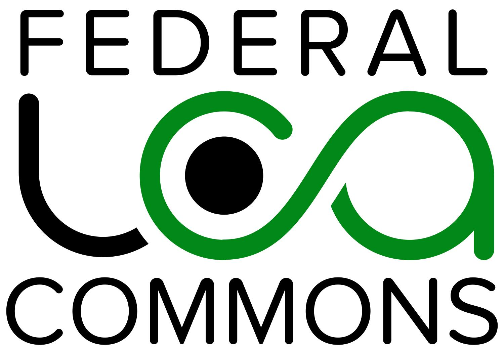

*Federal LCA Commons (FLCAC)*

# What is the Federal LCA Commons?
The Federal LCA Commons is an interagency community-of-practice focused on building synergies around sustainability research and policy within the United States government. The mission of the LCA Commons is to advance LCA data, research, and information systems; improve modelling methods and consistency; and increase public access to Federal LCA data and resources.  This handbook and the www.lcacommons.gov web repository are key tools for improving consistency and insuring access to federal LCA products.
# Who can publish on the LCA Commons?
Anyone can publish LCA Commons compliant LCA data sets and resources with the LCA Commons.  Representatives of industry groups and academia interested in publishing with the LCA Commons should consider submitting data with the USLCI, operated by the National Renewable Energy Lab. Members of the federal government, or their official representatives, can publish through the Federal LCA Commons.  Additionally, LCA data products produced through USDA funding can be published on the LCA Commons through the National Agricultural Library.

Publishing data on the LCA Commons comes with the expectation that data submitters have sufficient capacity to prepare data to be compliant with this guidance, and to study and successfully operate the publication workflow.  Please feel free to contact us to determine where might be the best home for your data.  
# What can be published on the LCA Commons?

# How to publish on www.lcacommons.gov
## Key terminology
## Overview of the preparation and publication process
## Roles and Actors
## Introduction to the publication description
## Metadata descriptors and publication conventions
### Elementary Flows
### Categorization
### Parameters
### Locations
### DOIs
#### Basics
A DOI, or Digital Object Identifier, is a persistent and unique identifier assigned to an object. This DOI permanently identifies content and related metadata for an object over the course of its lifecycle. DOI strings, in combination with a URL prefix, resolve to internet locations. Information about a digital object may change over time, including where to find it and who owns it, but its DOI will not change. The benefits of a DOI include greater discoverability and access to uniquely identified content, accessibility for long-term use, and citation of publications and research data for impact analysis.
DOIs require a commitment from the provider to maintain the URL associated with the DOI.
#### DOIs on the LCA Commons
Currently, the LCA Commons does not mint or issue DOIs.  To obtain a DOI, a researcher must submit a request for a DOI with an issuing repository, which will often be the authoritative landing page for the dataset.  For example, USDA funded research can obtain a DOI by submitting a request to the Ag Data Commons (data.nal.usda.gov) which will create a record (with extensive metadata) and persistent URL for the datatset.  The Ag Data Commons will then mint a DOI that will resolve to this record.  

Datasets with existing DOIs can be directlly linked to the LCA Commons through the creation of a "source" object in openLCA.  An openLCA source is a reference to an external resource, and can be directly associated with an openLCA process in the Modeling and Validation section of the process's metadata. 

#### What dataset gets a DOI
TODO: An explaination on what is citable from the LCA Commons perspective and how to guide people to making that determination.  The Ag Data Commons uses metrics that can serve as a guide for LCAC (see section 3.2 on externally published resources) :

https://data.nal.usda.gov/ag-data-commons-doi-guidelines-0

There is variability in what constitutes a citable unit of information in LCA, and what is meant by a "dataset"

Regarding guidance for citable datasets, my current thinking is:

1. The datasets is a citable contribution to the scholarly record
2. There exists a published or accessible report describing the datasets development and it's original intention and application.

#### How to create a source DOI and associate it with an openLCA process
To associate an existing DOI to an openLCA process, the first step is to create a new DOI source from the navigation tree.  Give the source a suitable name using the convention:

Name: "Data citation: [The Dataset Title]"

In the URL field, enter the complete DOI, for example:
URL:https://doi.org/10.15482/USDA.ADC/1504010

Enter the preferred citation in the "Text reference" field and the year of publication, and save the source.  Users will now be able to access the dataset URL directly from the openLCA source page.

With the DOI source created, it can be associated to an openLCA process by adding it to the sources table in the Modeling and Validation section of the metadata.

# Collaboration Server How-to
# Getting started with the Starter Database
# Metadata Tables and Guidance
# Publication Workflow descriptions
# References
https://www.iso.org/obp/ui/#iso:std:iso:26324:ed-1:v1:en
